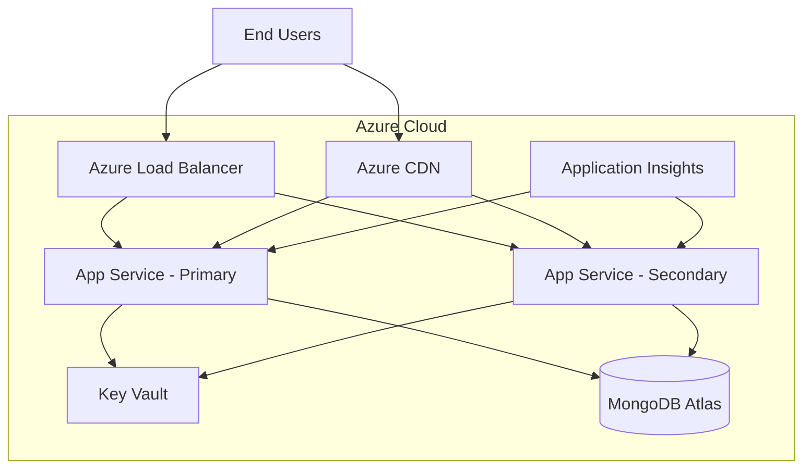
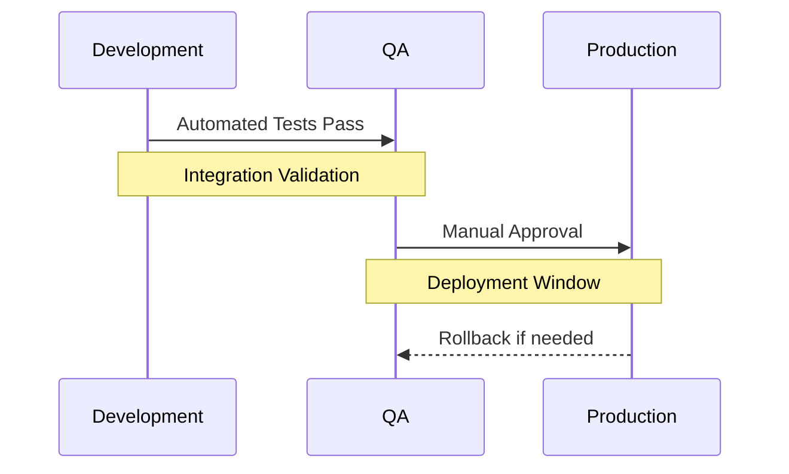
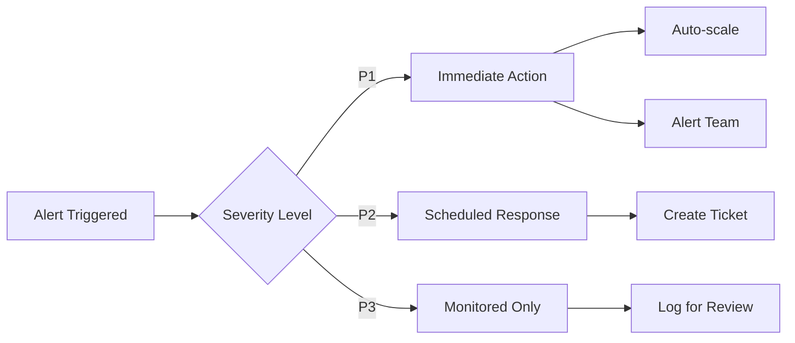
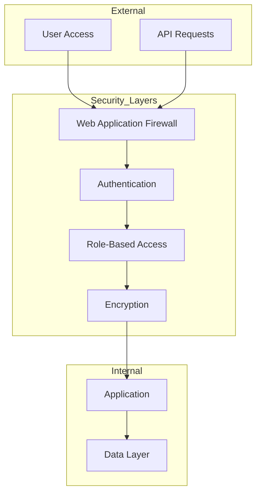

# CineScope Azure Maintenance and Training Plan

## 1. Azure Infrastructure Overview

CineScope leverages Azure's cloud infrastructure to provide a scalable, reliable movie review platform. Our architecture implements a multi-tier deployment strategy optimized for performance and cost efficiency.

### Core Infrastructure Components



The infrastructure utilizes Azure's regional redundancy with the following key specifications:

| Resource | Configuration | Purpose |
|----------|--------------|---------|
| App Service | Standard S1 | Application hosting |
| MongoDB Atlas | M10 Cluster | Data persistence |
| Azure CDN | Standard | Content delivery |
| Key Vault | Standard | Secret management |

## 2. Release Management Strategy

Our release management process follows a structured approach designed to minimize risk while maintaining rapid deployment capabilities.

### Deployment Flow

The deployment pipeline progresses through three distinct environments:

1. **Development Environment**
   - Continuous integration with each commit
   - Automated unit test execution
   - Developer sandbox for feature testing

2. **Quality Assurance**
   - Integration test automation
   - Performance benchmark validation
   - User acceptance testing

3. **Production**
   - Blue-green deployment strategy
   - Automated health checks
   - Rollback capability

This progression is managed through Azure DevOps with automated gates at each stage:



## 3. Monitoring and Performance Management

Application performance is continuously monitored through Application Insights, providing real-time visibility into system health and user experience.

### Key Performance Indicators

Our monitoring strategy focuses on four critical areas:

**1. User Experience Metrics**
- Page load time < 2 seconds
- API response time < 200ms
- Client-side rendering time < 1 second

**2. System Health**
- CPU utilization < 80%
- Memory usage < 85%
- Database connection pool efficiency > 95%

**3. Business Metrics**
- User registration success rate > 98%
- Review submission success rate > 99%
- Search functionality response time < 500ms

**4. Security Metrics**
- Failed authentication attempts
- Resource access patterns
- Data encryption status

### Automated Response Procedures

When monitoring thresholds are exceeded, the system implements a graduated response:



## 4. Disaster Recovery and Business Continuity

Our disaster recovery strategy implements a comprehensive approach to maintaining service availability:

### Data Protection Strategy

CineScope's data protection framework operates on multiple levels:

**Backup Schedule**
```plaintext
├── Hourly
│   └── Transaction Logs
├── Daily
│   ├── Full Database Backup
│   └── Application State
├── Weekly
│   ├── Configuration Backup
│   └── Security Policy Snapshot
└── Monthly
    └── Complete System Image
```

**Recovery Objectives**
- Recovery Time Objective (RTO): 30 minutes
- Recovery Point Objective (RPO): 5 minutes
- Service Level Agreement (SLA): 99.95%

## 5. Training and Knowledge Transfer

Training is structured into progressive modules that build upon each other to ensure comprehensive understanding of the system.

### Administrator Training Path

The training program follows a structured progression:

1. **Foundation (Week 1)**
   - Azure portal navigation
   - Resource management basics
   - Monitoring fundamentals

2. **Advanced Operations (Week 2)**
   - Pipeline management
   - Security administration
   - Performance optimization

3. **Emergency Response (Week 3)**
   - Incident management
   - Disaster recovery procedures
   - Crisis communication

4. **Optimization (Week 4)**
   - Cost management
   - Performance tuning
   - Capacity planning

Each module includes hands-on exercises and real-world scenarios, culminating in a practical assessment.

## 6. Security and Compliance

Our security framework implements defense-in-depth principles:

### Security Architecture



This comprehensive plan ensures CineScope's reliable operation while maintaining security, performance, and user satisfaction. Regular reviews and updates to this plan ensure it evolves with the platform's needs and technological advances.
