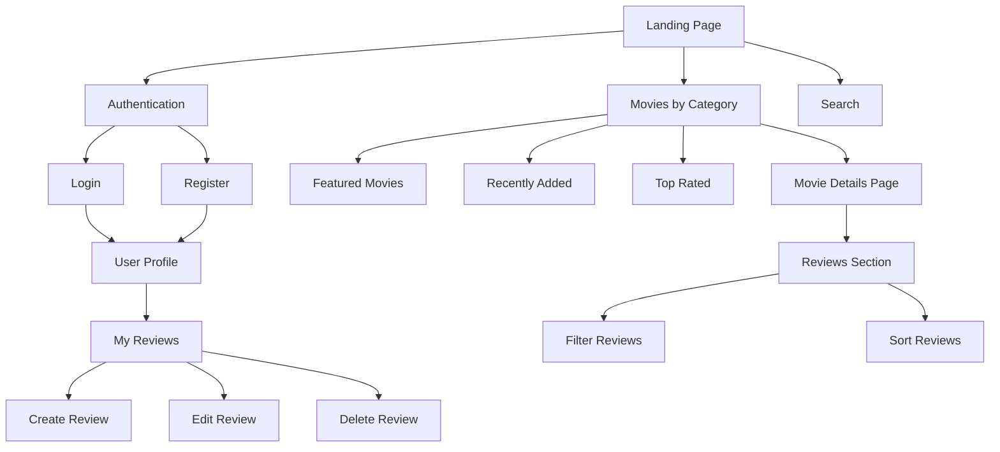

# Software Functional Requirements Document

for CineScope Movie Review Platform

Owen, Andrew Mack, Carter Wright, Rian Smart

Grand Canyon University: CST-326

February 11, 2025

Document Version 1.0

## AUTHORS

| Name | Role | Department |
|------|------|------------|
| Carter Wright | Scrum Master | Development |
| Rian Smart | Product Owner | Management |
| Owen | Developer | Development |
| Andrew Mack | Developer | Development |

## DOCUMENT HISTORY

| Date | Version | Document Revision Description | Document Author |
|------|---------|------------------------------|-----------------|
| 02/11/25 | 1.0 | Initial creation of Software Requirements Document | Team CineScope |

## APPROVALS

| Approval Date | Approved Version | Approver Role | Approver |
|--------------|------------------|---------------|----------|
| | 1.0 | | |

# Table of Contents

# Table of Contents

1. [Introduction](#1-introduction) ........................................................................... 
   
   1.1. [Purpose of the Document](#11-purpose-of-the-document) ......................... 
   1.2. [Project Scope](#12-project-scope) ..........................................................  
   1.3. [Related Documents and Resources](#13-related-documents-and-resources) ...  
   1.4. [Terms/Acronyms and Definitions](#14-termsacronyms-and-definitions) ... 
   1.5. [Risks and Assumptions](#15-risks-and-assumptions) ..................................
   
2. [System/Solutions Overview](#2-systemsolutions-overview) ............................ 
   2.1. [System Architecture and Communication](#21-system-architecture-and-communication) ... 
   2.2. [Site Navigation Structure](#22-site-navigation-structure) .........................  
   2.3. [User Interface Design](#23-user-interface-design) .................................
   
3. [Functional Specifications](#3-functional-specifications) ................................ 

   3.1. [Landing Page Implementation](#31-landing-page-implementation) .......................
   3.2. [Authentication System](#32-authentication-system) ..................................
   3.3. [Review Management](#33-review-management) ......................................  
   3.4. [Content Filtering](#34-content-filtering) ................................................  
   3.5. [Functional Requirements](#35-functional-requirements) ..........................  
   3.6. [Non-Functional Requirements](#36-non-functional-requirements) ..........................
   
4. [Implementation Plan](#4-implementation-plan) .............................................. 
   
5. [Quality Assurance](#5-quality-assurance) ......................................................  

 

# 1. Introduction

## 1.1 Purpose of the Document

This functional specification document provides comprehensive details about the implementation and behavior of the CineScope movie review platform. The document serves as a bridge between high-level user stories and detailed technical specifications, ensuring clear communication between stakeholders and development team members. By outlining functional requirements, technical constraints, and implementation approaches, this document facilitates the successful development of a robust movie review system.

## 1.2 Project Scope

CineScope addresses the need for a modern, user-friendly movie review platform that enables movie enthusiasts to share their opinions and discover new films. Built using C# ASP.NET Core Web App (MVC) with MongoDB as the database system, the platform delivers a responsive web interface where users can browse movies by various categories, write and manage reviews, and interact with other users' content.

The system implements comprehensive user authentication, ensuring secure access to personalized features while maintaining data privacy. Content moderation systems protect community standards through automated filtering and user feedback mechanisms. The platform's architecture emphasizes scalability and performance, supporting concurrent users while maintaining responsive interaction.

## 1.3 Related Documents and Resources

The requirements outlined in this document connect to a comprehensive set of project resources and documentation. Our development process utilizes several integrated platforms to manage different aspects of the project lifecycle.

Version Control and Source Code:
The project's source code is maintained in our GitHub repository at https://github.com/omniV1/CineScope. This repository contains the complete codebase, documentation, and development history.

Project Management:
Task tracking and sprint planning are managed through our Jira board at https://cinescopedev.atlassian.net/jira/software/projects/SCRUM/boards/1/backlog. This platform coordinates our development efforts and tracks progress across all project components.

Technical Documentation:
Detailed technical documentation and project guidelines are maintained in our Confluence space at https://cinescopedev.atlassian.net/wiki/spaces/CineScope/overview. This wiki serves as our central knowledge base and provides additional context for implementation details.

Supporting Documentation:
- Functional Requirements Specifications (FR-1 through FR-5)
- Non-Functional Requirements Specifications (NFR-1 through NFR-5)
- Use Case Diagrams (UC-1 through UC-5)
- Sprint Planning Materials
- User Stories and Acceptance Criteria
- Technical Architecture Documentation

## 1.4 Terms/Acronyms and Definitions

| Term/Acronym | Definition | Description |
|--------------|------------|-------------|
| MVC | Model View Controller | Architectural pattern separating data, logic, and presentation |
| CRUD | Create Read Update Delete | Basic database operations for content management |
| FR | Functional Requirement | Specific behavior or function the system must perform |
| NFR | Non-Functional Requirement | Quality attributes and performance standards |
| UC | Use Case | Description of user interactions with the system |
| API | Application Programming Interface | Interface for component communication |
| UI | User Interface | Visual elements and interactions |
| DB | Database | Structured data storage system |

## 1.5 Risks and Assumptions

The development of CineScope carries several important considerations for implementation. The system must carefully manage performance under high concurrent user loads, particularly during review submission and content filtering operations. Security remains paramount, requiring robust protection of user authentication and content management systems. Data integrity must be maintained during concurrent operations, while system availability requires careful monitoring during peak usage periods.

The project operates under several foundational assumptions. Users are expected to access the platform through modern web browsers supporting current web standards. The chosen MongoDB infrastructure should provide sufficient performance characteristics for anticipated data volumes. Network conditions must support acceptable response times for regular operation. The development team brings necessary expertise in C# and MongoDB development to implement required functionality.

# 2. System/Solutions Overview

## 2.1 System Architecture and Communication

The CineScope platform implements a comprehensive communication structure to support effective team collaboration and development workflows. Figure 1 illustrates the primary communication channels and their purposes.

Figure 1: Team Communication Pathways

The development architecture follows an N-layer design pattern that promotes separation of concerns and maintainability. Figure 2 shows the architectural layers and their relationships.

Figure 2: CineScope N-Layer Architecture

## 2.2 Site Navigation Structure

The platform implements a hierarchical navigation structure that organizes content and functionality logically for users. Figure 3 presents the complete site navigation map.

Figure 3: CineScope Site Navigation Map

## 2.3 User Interface Design

The following section presents the wireframes for key system interfaces. These wireframes illustrate the layout and functionality of major system components.

[Note: This section will be populated with wireframe designs showing the layout and interaction design for key system interfaces including:
- Landing page layout
- Movie detail views
- Review creation and management interfaces
- User authentication screens
- Search and filtering interfaces]

The platform implements a layered architecture optimizing separation of concerns and maintainability. The frontend layer utilizes Blazor components and WebAssembly interfaces to deliver responsive user experiences. A robust backend layer implements business logic through C# API controllers and specialized services. The data access layer manages MongoDB interactions while implementing efficient caching strategies.

This architecture supports key technical requirements including responsive performance, scalable operations, and maintainable code structure. Component isolation enables independent scaling and updates while maintaining system stability. The design emphasizes security through proper authentication mechanisms and data access controls.

# 3. Functional Specifications

## 3.1 Landing Page Implementation

The landing page serves as the primary entry point, presenting users with an intuitive interface for movie discovery. The implementation supports several distinct movie sections, including featured content, recently viewed films, and genre-based collections. Each section implements efficient content loading and navigation while maintaining responsive performance under load.

The page structure emphasizes modularity, enabling independent updates to specific sections without impacting overall functionality. Performance optimization includes appropriate caching strategies and lazy loading techniques to maintain quick response times. Error handling provides graceful degradation and clear user feedback when issues arise.

## 3.2 Authentication System

User authentication implements comprehensive security measures while maintaining usability. The login interface provides clear feedback and intuitive operation while enforcing robust security protocols. Password management includes secure recovery mechanisms and appropriate account protection measures such as temporary lockouts after failed attempts.

The system maintains secure session management with appropriate timeout handling and state synchronization. Authentication status remains clearly visible through consistent UI indicators. Integration with other system components ensures appropriate access control while maintaining security boundaries.

## 3.3 Review Management

The review system enables rich interaction with movie content through a comprehensive set of features. Users can create detailed reviews including ratings and textual feedback, with content filtering ensuring appropriate community standards. The interface supports both basic and advanced filtering options, allowing efficient content discovery and organization.

The implementation handles concurrent operations appropriately, maintaining data consistency while supporting multiple simultaneous users. Performance optimization ensures quick response times for common operations while maintaining system stability under load. Audit logging tracks significant operations while protecting user privacy.

## 3.4 Content Filtering

Content filtering maintains community standards through automated screening of user submissions. The system maintains an updated list of restricted content with automatic propagation and failover protection. Processing occurs within strict performance boundaries, completing analysis quickly while maintaining high accuracy rates.

The filtering engine implements sophisticated pattern matching while supporting efficient operation at scale. Error handling provides clear feedback when content requires modification. The system maintains detailed logging for administrative review while protecting user privacy.

## 3.5 Functional Requirements

The system's functional requirements encompass several key areas of functionality, each mapped to specific use cases and implementation tasks. These requirements define the core behaviors necessary for the CineScope platform to meet user needs effectively.

### Landing Page Requirements

| Use Case ID | Functional Req. ID | Functional Requirement |
|-------------|-------------------|---------------------|
| UC-1 | FR-1.1 | The System shall display movies on the Landing page |
| UC-1 | FR-1.2 | The System shall display section for Features Movies |
| UC-1 | FR-1.3 | The System shall display section for Recently Viewed Movies |
| UC-1 | FR-1.4 | The System shall display section for Top-Rated Movies |
| UC-1 | FR-1.5 | The System shall display section for Rom-Com Movies |
| UC-1 | FR-1.6 | The System shall display section for Thriller/Horror Movies |
| UC-1 | FR-1.7 | The System shall display section for Action Movies |
| UC-1 | FR-1.8 | The System shall display section for Sci-FI Movies |
| UC-1 | FR-1.9 | The System shall display section for Recently Added Movies |
| UC-1 | FR-1.10 | The System shall redirect the user to a movie's page if clicked |
| UC-1 | FR-1.11 | The System shall display an error message and log the user out if an error occurs |

### Review Management Requirements

| Use Case ID | Functional Req. ID | Functional Requirement |
|-------------|-------------------|---------------------|
| UC-2 | FR-2.1 | The system shall provide a "Filters" button on the movie reviews page |
| UC-2 | FR-2.2 | The system shall allow users to select a filter category |
| UC-2 | FR-2.3 | The system shall update the displayed reviews based on the selected filter |
| UC-2 | FR-2.4 | The system shall provide a "Sort" button on the movie reviews page |
| UC-2 | FR-2.5 | The system shall allow users to select a sorting option |
| UC-2 | FR-2.6 | The system shall update the displayed reviews based on the selected sorting order |
| UC-2 | FR-2.7 | The system shall display a message if no reviews match the selected filter |
| UC-2 | FR-2.8 | The system shall display an error message if an error occurs while filtering |

### User Review Operations

| Use Case ID | Functional Req. ID | Functional Requirement |
|-------------|-------------------|---------------------|
| UC-3 | FR-3.1 | The system shall provide a "Create Review" page |
| UC-3 | FR-3.2 | The system shall allow users to input movie title, rating, and review text |
| UC-3 | FR-3.3 | The system shall validate the review input for required fields |
| UC-3 | FR-3.4 | The system shall apply content filter to review text |
| UC-3 | FR-3.5 | The system shall save review to database if it passes filter |
| UC-3 | FR-3.6 | The system shall display confirmation message upon successful creation |
| UC-3 | FR-3.7 | The system shall display error message if review fails filter |

### Authentication Requirements

| Use Case ID | Functional Req. ID | Functional Requirement |
|-------------|-------------------|---------------------|
| UC-4 | FR-4.1 | The system shall allow users to login with unique credentials |
| UC-4 | FR-4.2 | The system shall lock account after three failed attempts |
| UC-4 | FR-4.3 | The system shall provide password reset functionality |
| UC-4 | FR-4.4 | The system shall allow users to log out |
| UC-4 | FR-4.5 | The system shall handle all authentication errors appropriately |
| UC-4 | FR-4.6 | The system shall validate credentials against database |
| UC-4 | FR-4.7 | The system shall ensure account security through monitoring |

### Content Filtering Requirements

| Use Case ID | Functional Req. ID | Functional Requirement |
|-------------|-------------------|---------------------|
| UC-5 | FR-5.1 | The system shall maintain a list of banned words and phrases |
| UC-5 | FR-5.2 | The system shall check review text against banned list |
| UC-5 | FR-5.3 | The system shall flag reviews containing inappropriate content |
| UC-5 | FR-5.4 | The system shall allow users to view the banned word list |

## 3.6 Non-Functional Requirements

The system must meet specific performance, reliability, and quality standards to ensure effective operation. These requirements define the operational characteristics necessary for optimal user experience.

### Performance Requirements

| ID | Non-Functional Requirement |
|----|---------------------------|
| NFR-1.1 | The system shall load the landing page within 3 seconds |
| NFR-1.2 | The system shall support 100 concurrent users |
| NFR-1.3 | The system shall be fully responsive on mobile and desktop |
| NFR-1.4 | The system shall use modular design for easy updates |
| NFR-1.6 | The system shall support the latest two versions of major browsers |

### Review System Requirements

| ID | Non-Functional Requirement |
|----|---------------------------|
| NFR-2.1 | The system shall update filtered reviews within 2 seconds |
| NFR-2.2 | The system shall support 100 concurrent users filtering reviews |
| NFR-2.3 | The system shall maintain 300ms maximum latency for queries |
| NFR-2.4 | The system shall limit users to 100 filter requests per hour |
| NFR-2.5 | The system shall maintain 90-day audit logs |

### Content Management Requirements

| ID | Non-Functional Requirement |
|----|---------------------------|
| NFR-5.1 | Content filter shall process text within 200ms up to 5000 characters |
| NFR-5.2 | System shall maintain 99.9% content filter accuracy |
| NFR-5.3 | Banned word list shall update within 30 seconds across instances |
| NFR-5.4 | System shall log filter rejections within 100ms |
| NFR-5.5 | System shall maintain backup with 5-second failover |

# 4. Implementation Plan

The development schedule organizes work into focused sprints, with clear dependencies and delivery milestones. Implementation is structured around core functional areas with specific Jira tasks tracking progress.

## Landing Page Development (SCRUM-19)
The landing page implementation establishes the foundation for user interaction. Development includes base layout creation (SCRUM-21), featured movies section (SCRUM-22), recently viewed movies (SCRUM-23), genre-based sections (SCRUM-24), and movie navigation (SCRUM-25). Error handling and recovery mechanisms (SCRUM-26) ensure system reliability.

## Authentication System (SCRUM-27)
User authentication development encompasses login interface creation (SCRUM-28), core authentication logic (SCRUM-29), password recovery system (SCRUM-30), and logout functionality (SCRUM-31). Additional components include error handling (SCRUM-32) and state management (SCRUM-33).

## Review Management System (SCRUM-34)
The review system implementation includes review form creation (SCRUM-35), review display functionality (SCRUM-36), update capabilities (SCRUM-37), and deletion mechanisms (SCRUM-38). Each component integrates with content filtering to maintain community standards.

## Content Filtering System (SCRUM-39)
Content filtering development includes banned word management (SCRUM-40), filter processing engine (SCRUM-41), API implementation (SCRUM-42), logging system (SCRUM-43), and user feedback mechanisms (SCRUM-44).

# 5. Quality Assurance

Testing encompasses functional verification, performance validation, and security assessment. Each component undergoes comprehensive testing to ensure compliance with both functional and non-functional requirements. Integration testing verifies proper component interaction, while load testing confirms performance under expected usage patterns.
