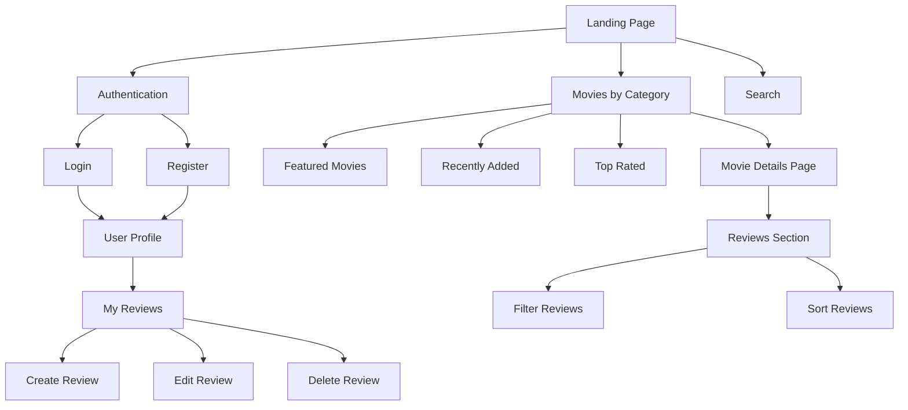
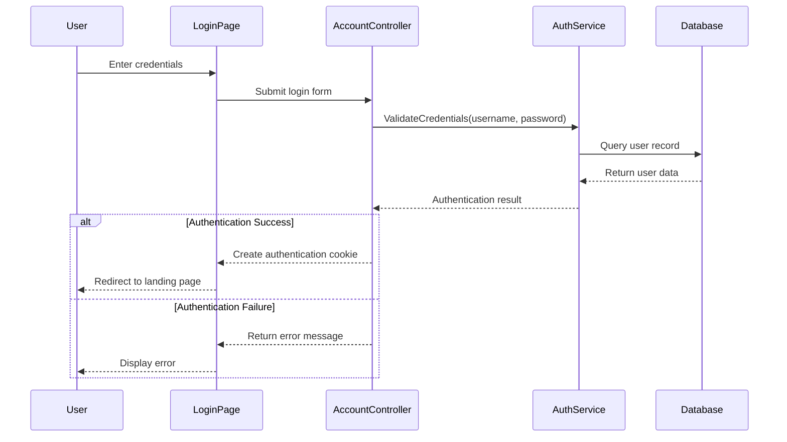
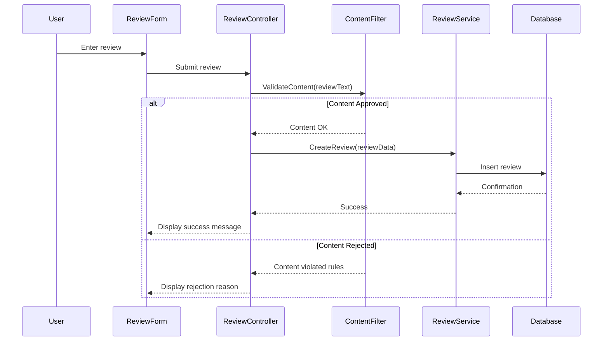
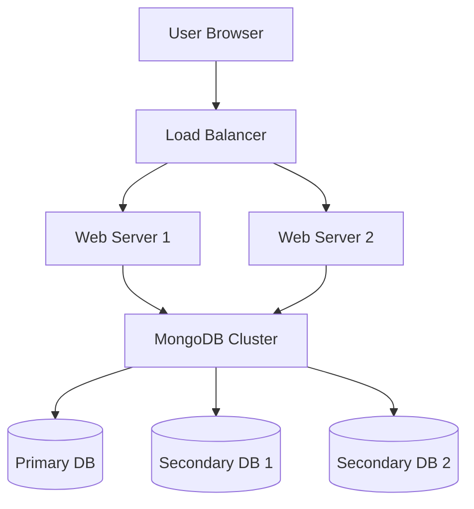

# Technical Design Document for CineScope Movie Review Platform

| Name | Role | Department |
|------|------|------------|
| Carter Wright | Scrum Master | Development |
| Rian Smart | Product Owner | Management |
| Owen | Developer | Development |
| Andrew Mack | Developer | Development |

Grand Canyon University: CST-326

February 24, 2025


## DOCUMENT HISTORY

| Date | Version | Document Revision Description | Document Author |
|------|---------|------------------------------|-----------------|
| 02/24/25 | 1.0 | Initial creation of Technical Design Document | Team CineScope |

## Introduction

CineScope is a modern, user-friendly movie review platform that enables movie enthusiasts to share opinions and discover new films. Built using C# ASP.NET Core Web App (MVC) with MongoDB as the database system, the platform delivers a responsive web interface for browsing movies, writing reviews, and interacting with other users' content.

## Scope

This technical design document describes the architectural components, system interactions, data flow, technical specifications, and implementation details required to develop the CineScope movie review platform. It serves as a bridge between the functional requirements and the actual implementation, providing developers with clear guidance on how to build the system components.

## Functional Description

CineScope is a comprehensive web application that allows users to browse movie information, read and write reviews, and interact with a community of movie enthusiasts. The following subsections provide technical details for the CineScope software implementation.

## Architecture

### System Architecture

The CineScope platform implements an N-layer architecture that promotes separation of concerns and maintainability. The architecture is composed of the following layers:


Figure 1: CineScope N-Layer Architecture

The architecture consists of:

1. **Presentation Layer**: Handles user interface rendering and user input processing
2. **Business Logic Layer**: Implements core application functionality and business rules
3. **Data Access Layer**: Manages database interactions and data persistence
4. **Database Layer**: MongoDB database system for data storage

### Communication Flow

The CineScope platform implements a comprehensive communication structure to support effective team collaboration and development workflows.


Figure 2: Team Communication Pathways

## User Interface Design

### Site Navigation Structure

The platform implements a hierarchical navigation structure that organizes content and functionality logically for users.



Figure 3: CineScope Site Navigation Map

### User Interface Wireframes

#### Authentication System Interfaces

The authentication system represents a core component of our user experience, implementing a comprehensive set of interfaces designed for security and ease of use.


Figure 4: Authentication System Wireframes

## Technical Implementation Details

### Landing Page Implementation

#### Technical Architecture

The landing page will be implemented as an ASP.NET Core MVC view with the following components:

1. **Controller**: `HomeController.cs`
   - Responsible for handling requests to the landing page
   - Retrieves movie data from movie service
   - Renders appropriate view based on user authentication status

2. **View**: `Index.cshtml`
   - Implements responsive layout using Bootstrap grid system
   - Renders movie carousels for different categories
   - Implements lazy loading for improved performance

3. **Services**:
   - `MovieService.cs`: Retrieves movie data from MongoDB
   - `CategoryService.cs`: Manages movie category information

#### Data Flow

1. User navigates to CineScope URL
2. `HomeController` receives request
3. Controller calls `MovieService` to retrieve featured, recent, and category-based movies
4. Controller builds `HomeViewModel` with movie data
5. Controller renders `Index.cshtml` view with model data
6. View displays movie carousels and navigation options

#### Performance Considerations

- Implement caching for frequently accessed movie data
- Use lazy loading for movie images to improve initial page load time
- Implement pagination for movie sections to limit initial data transfer
- Use MongoDB indexes to optimize movie retrieval queries

### Authentication System

#### Technical Architecture

The authentication system will be implemented using ASP.NET Core Identity framework with MongoDB integration:

1. **Controllers**:
   - `AccountController.cs`: Handles user registration, login, and password recovery
   - `ProfileController.cs`: Manages user profile information

2. **Models**:
   - `ApplicationUser.cs`: Extends IdentityUser with CineScope-specific properties
   - `LoginViewModel.cs`: Contains login form data
   - `RegisterViewModel.cs`: Contains registration form data

3. **Services**:
   - `AccountService.cs`: Implements business logic for user management
   - `AuthenticationService.cs`: Handles authentication workflows

#### User Authentication Flow



Figure 5: Authentication Sequence Diagram

#### Security Considerations

- Implement password hashing using PBKDF2 with 10,000 iterations
- Enforce password complexity requirements (8+ chars, mixed case, numbers, symbols)
- Implement account lockout after 3 failed login attempts
- Use HTTPS for all authentication-related communications
- Implement CSRF protection for all form submissions
- Store authentication tokens securely with appropriate expiration

### Review Management System

#### Technical Architecture

The review management system will be implemented with the following components:

1. **Controllers**:
   - `ReviewController.cs`: Handles CRUD operations for reviews
   - `FilterController.cs`: Manages review filtering and sorting

2. **Models**:
   - `Review.cs`: Contains review data including text, rating, and user information
   - `ReviewViewModel.cs`: View model for displaying reviews
   - `FilterViewModel.cs`: Contains filter and sort parameters

3. **Services**:
   - `ReviewService.cs`: Implements business logic for review operations
   - `FilterService.cs`: Handles filtering and sorting logic
   - `ContentFilterService.cs`: Implements content moderation

#### Database Schema

```
Review {
  _id: ObjectId,
  userId: ObjectId,
  movieId: ObjectId,
  rating: Number,
  text: String,
  createdAt: DateTime,
  updatedAt: DateTime,
  isApproved: Boolean,
  flaggedWords: Array<String>
}
```

#### Review Creation Flow



Figure 6: Review Creation Sequence Diagram

### Content Filtering System

#### Technical Architecture

The content filtering system will be implemented with the following components:

1. **Services**:
   - `ContentFilterService.cs`: Implements the content filtering logic
   - `BannedWordService.cs`: Manages the banned word dictionary

2. **Models**:
   - `ContentFilterResult.cs`: Contains filtering result and violations
   - `BannedWord.cs`: Represents a banned word or phrase with severity level

#### Content Filtering Algorithm

1. Convert text to lowercase for case-insensitive matching
2. Tokenize input text into words and phrases
3. Compare against banned word dictionary using efficient matching algorithm
4. Score content based on matched words and their severity
5. Determine approval status based on configured thresholds
6. Return detailed result with specific violations

#### Performance Considerations

- Use in-memory dictionary for banned words with periodic refreshes
- Implement caching for frequently used patterns
- Use parallel processing for long text reviews
- Optimize text matching algorithms for performance

## Databases

### MongoDB Schema Design

CineScope uses MongoDB as its primary data store. The following collections will be implemented:

1. **Users Collection**
   ```
   User {
     _id: ObjectId,
     username: String,
     email: String,
     passwordHash: String,
     roles: Array<String>,
     createdAt: DateTime,
     lastLogin: DateTime,
     isLocked: Boolean,
     failedLoginAttempts: Number
   }
   ```

2. **Movies Collection**
   ```
   Movie {
     _id: ObjectId,
     title: String,
     description: String,
     releaseDate: DateTime,
     genres: Array<String>,
     director: String,
     actors: Array<String>,
     posterUrl: String,
     averageRating: Number,
     reviewCount: Number
   }
   ```

3. **Reviews Collection**
   ```
   Review {
     _id: ObjectId,
     userId: ObjectId,
     movieId: ObjectId,
     rating: Number,
     text: String,
     createdAt: DateTime,
     updatedAt: DateTime,
     isApproved: Boolean,
     flaggedWords: Array<String>
   }
   ```

4. **BannedWords Collection**
   ```
   BannedWord {
     _id: ObjectId,
     word: String,
     severity: Number,
     category: String,
     isActive: Boolean,
     addedAt: DateTime,
     updatedAt: DateTime
   }
   ```

### Indexing Strategy

The following indexes will be created to optimize query performance:

1. **Users Collection**
   - Username (unique)
   - Email (unique)
   - LastLogin (for inactive user cleanup)

2. **Movies Collection**
   - Title (text index)
   - Genres (for category filtering)
   - ReleaseDate (for sorting)
   - AverageRating (for sorting)

3. **Reviews Collection**
   - MovieId (for retrieving movie reviews)
   - UserId (for retrieving user reviews)
   - CreatedAt (for sorting)
   - Compound index (MovieId, CreatedAt) for efficient sorted movie reviews

### Data Access Patterns

The Data Access Layer will implement the Repository pattern with the following components:

1. **Interfaces**:
   - `IUserRepository`
   - `IMovieRepository`
   - `IReviewRepository`
   - `IBannedWordRepository`

2. **Implementations**:
   - `MongoUserRepository`
   - `MongoMovieRepository`
   - `MongoReviewRepository`
   - `MongoBannedWordRepository`

## Security Implementation

### Authentication Security

- Implement JWT-based authentication for API access
- Use secure cookie storage for web sessions
- Implement proper CORS configuration for API security
- Use HTTPS for all communications
- Implement proper password hashing and salting
- Use proper parameterization to prevent injection attacks

### Content Security

- Sanitize all user input to prevent XSS attacks
- Implement Content Security Policy headers
- Use HTTP-only cookies for session management
- Implement proper CSRF protection

## Testing Strategy

### Unit Testing

- Implement unit tests for all service classes using xUnit
- Achieve minimum 80% code coverage for service layer
- Mock external dependencies using Moq framework
- Implement test data generation using AutoFixture

### Integration Testing

- Implement integration tests for database access
- Test controller endpoints with TestServer
- Verify authentication flows with integration tests
- Test content filtering with known good/bad inputs

### Performance Testing

- Implement load tests for key user flows
- Verify performance under expected concurrent user load
- Test database performance with representative data volumes
- Monitor memory usage under sustained load

## Deployment Architecture

### Production Environment



Figure 7: Production Deployment Architecture

## Appendix

### Technology Stack

- **Frontend**: ASP.NET Core MVC, Bootstrap, jQuery
- **Backend**: C# ASP.NET Core
- **Database**: MongoDB
- **Testing**: xUnit, Moq, AutoFixture
- **CI/CD**: GitHub Actions
- **Hosting**: Vercel 

### Third-Party Libraries

| Library | Version | Purpose |
|---------|---------|---------|
| MongoDB.Driver | 2.19.0 | MongoDB access |
| AspNetCore.Identity | 6.0.0 | User authentication |
| Newtonsoft.Json | 13.0.2 | JSON serialization |
| NLog | 5.1.2 | Logging framework |
| Bootstrap | 5.2.3 | UI framework |
| xUnit | 2.4.2 | Testing framework |
| Moq | 4.18.4 | Mocking library |