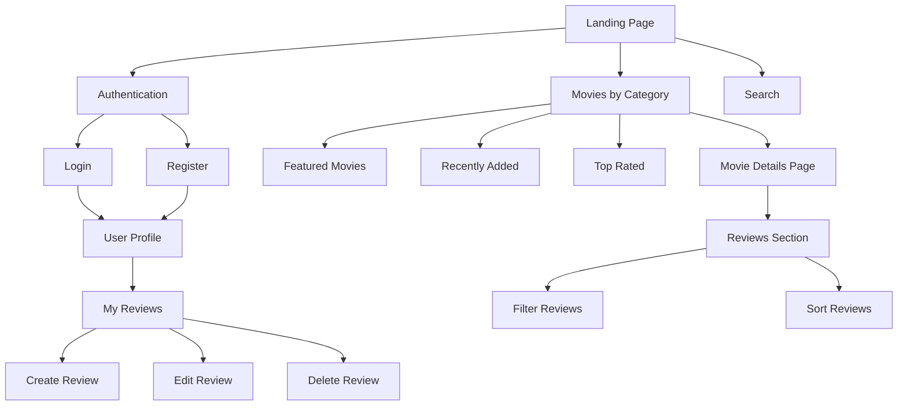
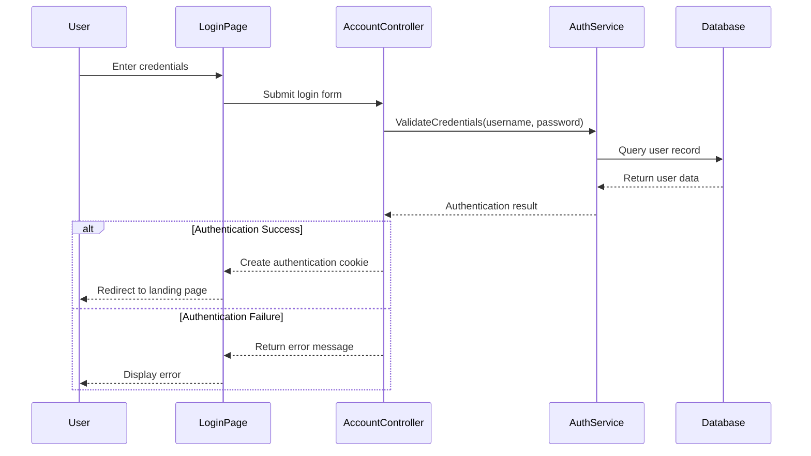
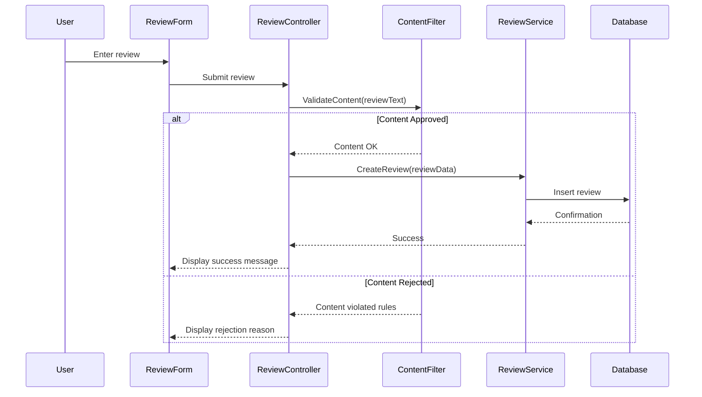
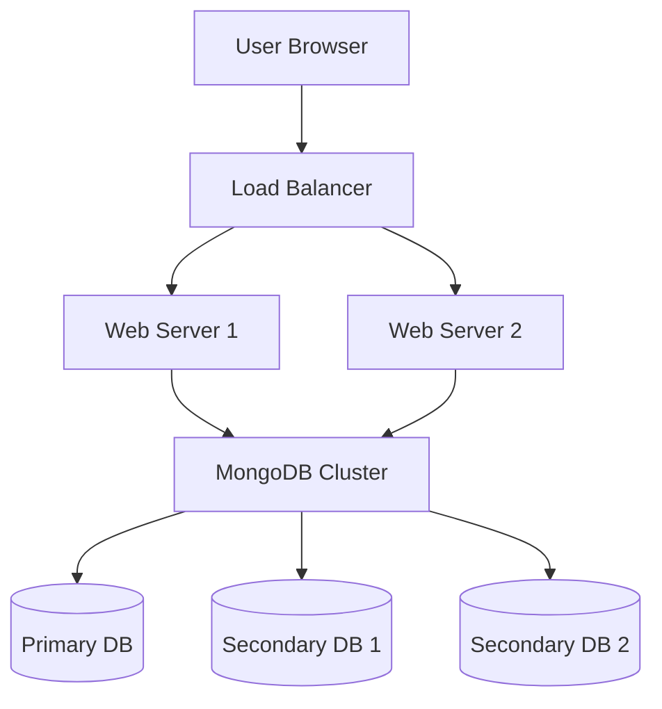

# Technical Design Document for CineScope Movie Review Platform

| Name | Role | Department |
|------|------|------------|
| Carter Wright | Scrum Master | Development |
| Rian Smart | Product Owner | Management |
| Owen | Developer | Development |
| Andrew Mack | Developer | Development |

Grand Canyon University: CST-326

March 02, 2025


## DOCUMENT HISTORY

| Date | Version | Document Revision Description | Document Author |
|------|---------|------------------------------|-----------------|
| 02/24/25 | 1.0 | Initial creation of Technical Design Document | Team CineScope |

## Introduction

CineScope is a modern, user-friendly movie review platform that enables movie enthusiasts to share opinions and discover new films. Built using Blazor C# ASP.NET Web App (MVC) with MongoDB as the database system, the platform delivers a responsive web interface for browsing movies, writing reviews, and interacting with other users' content.

## Scope

This technical design document describes the architectural components, system interactions, data flow, technical specifications, and implementation details required to develop the CineScope movie review platform. It serves as a bridge between the functional requirements and the actual implementation, providing developers with clear guidance on how to build the system components.

## Functional Description

CineScope is a comprehensive web application that allows users to browse movie information, read and write reviews, and interact with a community of movie enthusiasts. The following subsections provide technical details for the CineScope software implementation.

## Architecture

### System Architecture

The CineScope platform implements an N-layer architecture that promotes separation of concerns and maintainability. The architecture is composed of the following layers:

 

Figure 1: CineScope N-Layer Architecture

The architecture consists of:

1. **Presentation Layer**: Handles user interface rendering and user input processing
2. **Business Logic Layer**: Implements core application functionality and business rules
3. **Data Access Layer**: Manages database interactions and data persistence
4. **Database Layer**: MongoDB database system for data storage

### Communication Flow

The CineScope platform implements a comprehensive communication structure to support effective team collaboration and development workflows.


Figure 2: Team Communication Pathways

## User Interface Design

### Site Navigation Structure

The platform implements a hierarchical navigation structure that organizes content and functionality logically for users.



Figure 3: CineScope Site Navigation Map


### User Interface Wireframes

The following section presents detailed wireframe specifications for key system interfaces, organized according to typical user interaction flow through the CineScope platform.

#### 1. Landing Page Interface


The landing page serves as the primary entry point to CineScope, A red curtain frames the central "CINESCOPE" logo, conveying the cinematic focus of the platform. Two prominent action buttons, "LOGIN" and "REGISTER", guide users toward immediate engagement with the platform.

#### 2. Authentication System Interfaces


##### 2.1 Login Interface
The login interface maintains the established branding while streamlining the authentication process. Users encounter a clean, focused layout with clearly labeled input fields for username and password. Convenience features include "Forgot Username?" and "Forgot Password?" recovery options positioned near their relevant fields. Social media authentication alternatives appear as distinct buttons for Facebook, Google, and Apple ID integration. New users are guided to the registration process through a prominent link, while help center access remains readily available.


##### 2.2 Registration Interface
The registration process implements a structured data collection form that prioritizes clarity and completeness. Users provide essential information through clearly labeled fields for name, email address, mobile number, and password with confirmation. The interface includes a mandatory terms and conditions acceptance checkbox. A prominent "Register" button appears once all required fields are complete. Help center access is maintained through a visible link, ensuring support throughout the registration process.


##### 2.3 Registration Success
Upon successful registration, users receive immediate visual confirmation through a green checkmark indicator. The interface displays a countdown to automatic redirection while providing a manual redirect option. The help center link remains accessible during this transition phase.

#### 3. Movie Browsing Interfaces


##### 3.1 Movies by Category
The category browsing interface presents film collections through a grid-based layout that prioritizes visual recognition. Each movie appears as a poster thumbnail with title and year information. The layout implements responsive design, adjusting column count based on viewport width. Category headers clearly identify each collection section, while navigation controls support both scrolling and pagination access methods.

##### 3.2 Featured Movies Section
The featured content section presents highlighted movies through a carousel presentation. Each featured film displays with a large poster image and prominent title treatment. Brief descriptive text provides immediate content context, while a clear "View Details" action button encourages deeper engagement. The carousel implements intuitive navigation controls that remain visible during interaction.

##### 3.3 Top Rated Movies Section
The top rated section emphasizes community validation through a visually distinct presentation approach. Each film displays not only its poster and title but also its aggregate star rating using a consistent visual indicator. The section header clearly identifies the curation method, while a subtle sorting control allows users to refine the display order according to different ranking metrics.

#### 4. Movie Details Interface


The movie details interface provides comprehensive film information through several distinct sections:

##### 4.1 Primary Information
A prominent display of the movie poster accompanies basic details including title, release year, and language. The overall rating appears prominently near the top of the page.

##### 4.2 Description Section
The movie's plot summary and key details appear in a clearly formatted text block, providing immediate context for viewers.

##### 4.3 Cast Information
A horizontal scroll of cast member thumbnails allows quick recognition of key performers, each with associated character information.

##### 4.4 Review Collection
User reviews appear in a dedicated section, displaying individual ratings and written feedback in a consistent format.

##### 4.5 Similar Content
Related movie suggestions appear as thumbnail previews, encouraging further platform exploration.

#### 5. Search and Filtering Interfaces


##### 5.1 Search Results Interface
The search results interface presents matched content in a clear, scannable format. Each result displays essential information including poster thumbnail, title, year, and rating. The interface implements a dual-view option allowing users to toggle between grid and list presentations. Filter controls appear in a collapsible sidebar, providing refinement options without consuming excessive screen space.

##### 5.2 Content Filtering Interface
The filtering interface presents categorization options through a series of expandable sections. Each filter category (genre, year, rating) presents appropriate control types including checkboxes, range sliders, and selectors. Applied filters appear as removable tags at the top of the results area, allowing quick modification. A prominent "Apply Filters" button confirms selections, while a "Reset" option allows quick restoration of default views.

#### 6. Review System Interfaces


##### 6.1 Review Creation Interface
The review creation process centers around the specific movie being reviewed, displaying the title and release year prominently. A five-star rating system allows for quick scoring, while a dedicated text area accepts detailed written feedback. The interface includes a persistent navigation bar for accessing key platform features during review composition.


##### 6.2 Review Management Interface
The "My Reviews" section presents a user's review history in a scrollable format. Each entry displays the movie title, year, star rating, and a preview of the written review. The interface allows for quick assessment of past contributions while maintaining easy access to full review content.

##### 6.3 Review Editing Interface
The editing interface maintains context by displaying the original review details while enabling focused modifications. The star rating control allows immediate adjustment, while the text field presents the existing content in an editable format. Clear "Save" and "Cancel" actions provide unambiguous interaction paths.

#### 7. User Profile Management


##### 7.1 Profile Overview
The profile management interface organizes user-specific functions into logical sections. Personal details and review collections are accessible through clear navigation elements. The interface includes profile image management and a straightforward logout option. This centralized hub allows users to manage all aspects of their platform presence.


##### 7.2 Profile Editing
The profile editing interface presents user information in an editable format with clear interaction points. Each field – name, username, password, email address, and mobile number – features an accompanying edit icon. The layout maintains consistency with the platform's overall design language while clearly indicating editable elements.

#### 8. Navigation Elements


The platform implements persistent navigation through a bottom-mounted bar containing four key elements:

##### 8.1 Movie Catalog Access
Direct access to the full movie collection, organized by categories including top rated, new releases, and featured selections.

##### 8.2 Search Functionality
A powerful search interface allows users to quickly locate specific content within the platform.

##### 8.3 Bookmarking System
Users can maintain collections of favorite or saved content for future reference.

##### 8.4 Profile Access
Quick access to user-specific functions and settings remains consistently available.

All interfaces maintain visual consistency through the platform's signature red and gray color scheme, ensuring a cohesive user experience across all functional areas. Typography and spacing follow established patterns that prioritize readability and clear information hierarchy.


## Technical Implementation Details

### Landing Page Implementation

#### Technical Architecture

The landing page will be implemented as an ASP.NET Core MVC view with the following components:

1. **Controller**: `HomeController.cs`
   - Responsible for handling requests to the landing page
   - Retrieves movie data from movie service
   - Renders appropriate view based on user authentication status

2. **View**: `Index.cshtml`
   - Implements responsive layout using Bootstrap grid system
   - Renders movie carousels for different categories
   - Implements lazy loading for improved performance

3. **Services**:
   - `MovieService.cs`: Retrieves movie data from MongoDB
   - `CategoryService.cs`: Manages movie category information

#### Data Flow

1. User navigates to CineScope URL
2. `HomeController` receives request
3. Controller calls `MovieService` to retrieve featured, recent, and category-based movies
4. Controller builds `HomeViewModel` with movie data
5. Controller renders `Index.cshtml` view with model data
6. View displays movie carousels and navigation options

#### Performance Considerations

- Implement caching for frequently accessed movie data
- Use lazy loading for movie images to improve initial page load time
- Implement pagination for movie sections to limit initial data transfer
- Use MongoDB indexes to optimize movie retrieval queries

### Authentication System

#### Technical Architecture

The authentication system will be implemented using ASP.NET Core Identity framework with MongoDB integration:

1. **Controllers**:
   - `AccountController.cs`: Handles user registration, login, and password recovery
   - `ProfileController.cs`: Manages user profile information

2. **Models**:
   - `ApplicationUser.cs`: Extends IdentityUser with CineScope-specific properties
   - `LoginViewModel.cs`: Contains login form data
   - `RegisterViewModel.cs`: Contains registration form data

3. **Services**:
   - `AccountService.cs`: Implements business logic for user management
   - `AuthenticationService.cs`: Handles authentication workflows

#### User Authentication Flow



Figure 5: Authentication Sequence Diagram

#### Security Considerations

- Implement password hashing using PBKDF2 with 10,000 iterations
- Enforce password complexity requirements (8+ chars, mixed case, numbers, symbols)
- Implement account lockout after 3 failed login attempts
- Use HTTPS for all authentication-related communications
- Implement CSRF protection for all form submissions
- Store authentication tokens securely with appropriate expiration

### Review Management System

#### Technical Architecture

The review management system will be implemented with the following components:

1. **Controllers**:
   - `ReviewController.cs`: Handles CRUD operations for reviews
   - `FilterController.cs`: Manages review filtering and sorting

2. **Models**:
   - `Review.cs`: Contains review data including text, rating, and user information
   - `ReviewViewModel.cs`: View model for displaying reviews
   - `FilterViewModel.cs`: Contains filter and sort parameters

3. **Services**:
   - `ReviewService.cs`: Implements business logic for review operations
   - `FilterService.cs`: Handles filtering and sorting logic
   - `ContentFilterService.cs`: Implements content moderation

#### Database Schema

```
Review {
  _id: ObjectId,
  userId: ObjectId,
  movieId: ObjectId,
  rating: Number,
  text: String,
  createdAt: DateTime,
  updatedAt: DateTime,
  isApproved: Boolean,
  flaggedWords: Array<String>
}
```

#### Review Creation Flow



Figure 6: Review Creation Sequence Diagram

### Content Filtering System

#### Technical Architecture

The content filtering system will be implemented with the following components:

1. **Services**:
   - `ContentFilterService.cs`: Implements the content filtering logic
   - `BannedWordService.cs`: Manages the banned word dictionary

2. **Models**:
   - `ContentFilterResult.cs`: Contains filtering result and violations
   - `BannedWord.cs`: Represents a banned word or phrase with severity level

#### Content Filtering Algorithm

1. Convert text to lowercase for case-insensitive matching
2. Tokenize input text into words and phrases
3. Compare against banned word dictionary using efficient matching algorithm
4. Score content based on matched words and their severity
5. Determine approval status based on configured thresholds
6. Return detailed result with specific violations

#### Performance Considerations

- Use in-memory dictionary for banned words with periodic refreshes
- Implement caching for frequently used patterns
- Use parallel processing for long text reviews
- Optimize text matching algorithms for performance

## Databases

### MongoDB Schema Design

CineScope uses MongoDB as its primary data store. The following collections will be implemented:

1. **Users Collection**
   ```
   User {
     _id: ObjectId,
     username: String,
     email: String,
     passwordHash: String,
     roles: Array<String>,
     createdAt: DateTime,
     lastLogin: DateTime,
     isLocked: Boolean,
     failedLoginAttempts: Number
   }
   ```

2. **Movies Collection**
   ```
   Movie {
     _id: ObjectId,
     title: String,
     description: String,
     releaseDate: DateTime,
     genres: Array<String>,
     director: String,
     actors: Array<String>,
     posterUrl: String,
     averageRating: Number,
     reviewCount: Number
   }
   ```

3. **Reviews Collection**
   ```
   Review {
     _id: ObjectId,
     userId: ObjectId,
     movieId: ObjectId,
     rating: Number,
     text: String,
     createdAt: DateTime,
     updatedAt: DateTime,
     isApproved: Boolean,
     flaggedWords: Array<String>
   }
   ```

4. **BannedWords Collection**
   ```
   BannedWord {
     _id: ObjectId,
     word: String,
     severity: Number,
     category: String,
     isActive: Boolean,
     addedAt: DateTime,
     updatedAt: DateTime
   }
   ```

### Indexing Strategy

The following indexes will be created to optimize query performance:

1. **Users Collection**
   - Username (unique)
   - Email (unique)
   - LastLogin (for inactive user cleanup)

2. **Movies Collection**
   - Title (text index)
   - Genres (for category filtering)
   - ReleaseDate (for sorting)
   - AverageRating (for sorting)

3. **Reviews Collection**
   - MovieId (for retrieving movie reviews)
   - UserId (for retrieving user reviews)
   - CreatedAt (for sorting)
   - Compound index (MovieId, CreatedAt) for efficient sorted movie reviews

### Data Access Patterns

The Data Access Layer will implement the Repository pattern with the following components:

1. **Interfaces**:
   - `IUserRepository`
   - `IMovieRepository`
   - `IReviewRepository`
   - `IBannedWordRepository`

2. **Implementations**:
   - `MongoUserRepository`
   - `MongoMovieRepository`
   - `MongoReviewRepository`
   - `MongoBannedWordRepository`

## Security Implementation

### Authentication Security

- Use secure cookie storage for web sessions
- Implement proper CORS configuration for API security
- Use HTTPS for all communications
- Implement proper password hashing and salting
- Use proper parameterization to prevent injection attacks

### Content Security

- Sanitize all user input to prevent XSS attacks
- Implement Content Security Policy headers
- Use HTTP-only cookies for session management
- Implement proper CSRF protection

## Testing Strategy

### Unit Testing

- Implement unit tests for all service classes using xUnit
- Achieve minimum 80% code coverage for service layer
- Mock external dependencies using Moq framework
- Implement test data generation using AutoFixture

### Integration Testing

- Implement integration tests for database access
- Test controller endpoints with TestServer
- Verify authentication flows with integration tests
- Test content filtering with known good/bad inputs

### Performance Testing

- Implement load tests for key user flows
- Verify performance under expected concurrent user load
- Test database performance with representative data volumes
- Monitor memory usage under sustained load

## Deployment Architecture

### Production Environment



Figure 7: Production Deployment Architecture

## Appendix

### Technology Stack

- **Frontend**: ASP.NET Blazor Web App, Bootstrap, jQuery
- **Backend**: C# ASP.NET Core
- **Database**: MongoDB
- **Testing**: xUnit, Moq, AutoFixture
- **CI/CD**: GitHub Actions
- **Hosting**: Vercel 

### Third-Party Libraries

| Library | Version | Purpose |
|---------|---------|---------|
| MongoDB.Driver | 2.19.0 | MongoDB access |
| AspNetCore.Identity | 6.0.0 | User authentication |
| Newtonsoft.Json | 13.0.2 | JSON serialization |
| NLog | 5.1.2 | Logging framework |
| Bootstrap | 5.2.3 | UI framework |
| xUnit | 2.4.2 | Testing framework |
| Moq | 4.18.4 | Mocking library |
