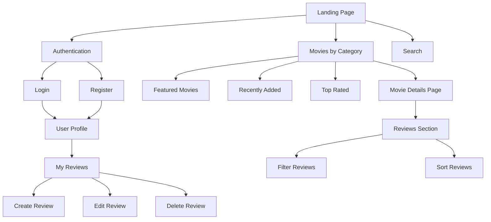
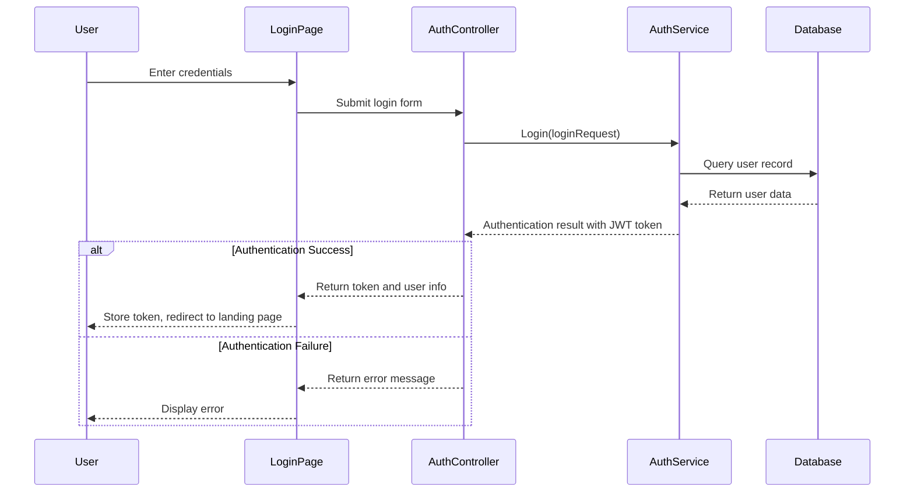
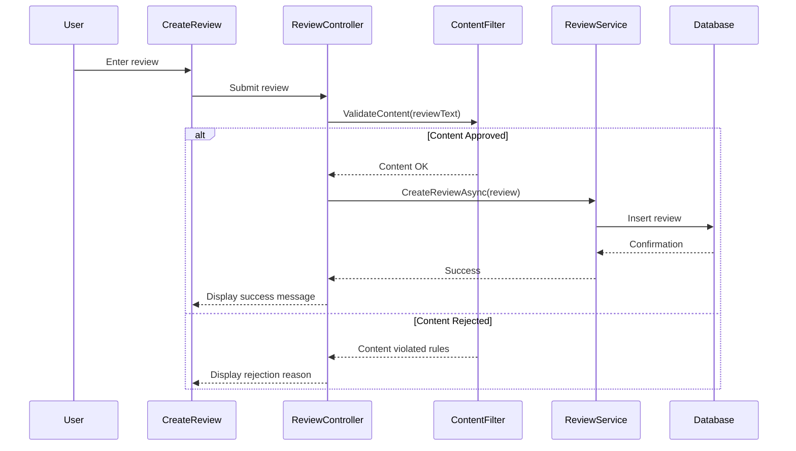
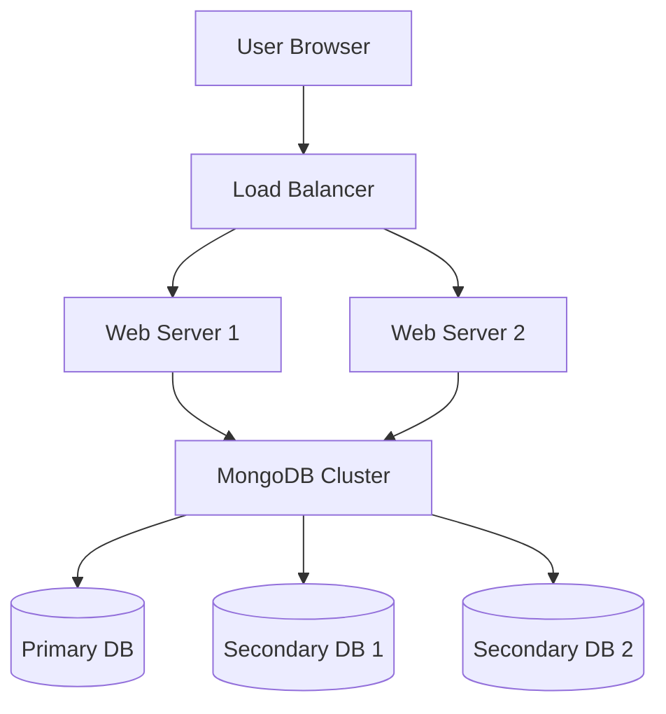

# Technical Design Document for CineScope Movie Review Platform

| Name | Role | Department |
|------|------|------------|
| Carter Wright | Scrum Master | Development |
| Rian Smart | Product Owner | Management |
| Owen | Developer | Development |
| Andrew Mack | Developer | Development |

Grand Canyon University: CST-326

March 02, 2025


## DOCUMENT HISTORY

| Date | Version | Document Revision Description | Document Author |
|------|---------|------------------------------|-----------------|
| 02/24/25 | 1.0 | Initial creation of Technical Design Document | Team CineScope |
| 03/31/25 | 1.1 | Updated with implementation details and corrected architecture | Team CineScope |

## Introduction

CineScope is a modern, user-friendly movie review platform that enables movie enthusiasts to share opinions and discover new films. Built using Blazor WebAssembly with a C# ASP.NET Core backend and MongoDB as the database system, the platform delivers a responsive web interface for browsing movies, writing reviews, and interacting with other users' content.

## Scope

This technical design document describes the architectural components, system interactions, data flow, technical specifications, and implementation details required to develop the CineScope movie review platform. It serves as a bridge between the functional requirements and the actual implementation, providing developers with clear guidance on how to build the system components.

## Functional Description

CineScope is a comprehensive web application that allows users to browse movie information, read and write reviews, and interact with a community of movie enthusiasts. The following subsections provide technical details for the CineScope software implementation.

## Architecture

### System Architecture

The CineScope platform implements a client-server architecture with a clear separation between frontend and backend components:

1. **Client Layer**: Blazor WebAssembly application running in the browser
2. **Server Layer**: ASP.NET Core Web API with controller endpoints
3. **Service Layer**: Business logic implementation with services
4. **Data Access Layer**: MongoDB data repositories
5. **Database Layer**: MongoDB database for data storage

### Communication Flow

The application follows a standard client-server communication model:
- Client-side Blazor WebAssembly application makes HTTP requests to the server
- Server processes requests through controller endpoints
- Services implement business logic and interact with the database
- Data flows back to the client as JSON responses

## User Interface Design

### Site Navigation Structure

The platform implements a hierarchical navigation structure that organizes content and functionality logically for users.



Figure 3: CineScope Site Navigation Map


### User Interface Wireframes

The following section presents detailed wireframe specifications for key system interfaces, organized according to typical user interaction flow through the CineScope platform.

#### 1. Landing Page Interface

Figure 4: Landing Page Wireframe


The landing page serves as the primary entry point to CineScope, A red curtain frames the central "CINESCOPE" logo, conveying the cinematic focus of the platform. Two prominent action buttons, "LOGIN" and "REGISTER", guide users toward immediate engagement with the platform.

#### 2. Authentication System Interfaces

Figure 5: Login Wireframe


##### 2.1 Login Interface
The login interface maintains the established branding while streamlining the authentication process. Users encounter a clean, focused layout with clearly labeled input fields for username and password. Convenience features include "Forgot Username?" and "Forgot Password?" recovery options positioned near their relevant fields. Social media authentication alternatives appear as distinct buttons for Facebook, Google, and Apple ID integration. New users are guided to the registration process through a prominent link, while help center access remains readily available.


Figure 5: Registration Wireframe


##### 2.2 Registration Interface
The registration process implements a structured data collection form that prioritizes clarity and completeness. Users provide essential information through clearly labeled fields for name, email address, mobile number, and password with confirmation. The interface includes a mandatory terms and conditions acceptance checkbox. A prominent "Register" button appears once all required fields are complete. Help center access is maintained through a visible link, ensuring support throughout the registration process.


Figure 6: Registration Successful Wireframe


##### 2.3 Registration Success
Upon successful registration, users receive immediate visual confirmation through a green checkmark indicator. The interface displays a countdown to automatic redirection while providing a manual redirect option. The help center link remains accessible during this transition phase.

#### 3. Movie Browsing Interfaces


Figure 7: Movie Browsing Wireframe


##### 3.1 Movies by Category
The category browsing interface presents film collections through a grid-based layout that prioritizes visual recognition. Each movie appears as a poster thumbnail with title and year information. The layout implements responsive design, adjusting column count based on viewport width. Category headers clearly identify each collection section, while navigation controls support both scrolling and pagination access methods.

##### 3.2 Featured Movies Section
The featured content section presents highlighted movies through a carousel presentation. Each featured film displays with a large poster image and prominent title treatment. Brief descriptive text provides immediate content context, while a clear "View Details" action button encourages deeper engagement. The carousel implements intuitive navigation controls that remain visible during interaction.

##### 3.3 Top Rated Movies Section
The top rated section emphasizes community validation through a visually distinct presentation approach. Each film displays not only its poster and title but also its aggregate star rating using a consistent visual indicator. The section header clearly identifies the curation method, while a subtle sorting control allows users to refine the display order according to different ranking metrics.

#### 4. Movie Details Interface


Figure 8: Movie Details Wireframe


The movie details interface provides comprehensive film information through several distinct sections:

##### 4.1 Primary Information
A prominent display of the movie poster accompanies basic details including title, release year, and language. The overall rating appears prominently near the top of the page.

##### 4.2 Description Section
The movie's plot summary and key details appear in a clearly formatted text block, providing immediate context for viewers.

##### 4.3 Cast Information
A horizontal scroll of cast member thumbnails allows quick recognition of key performers, each with associated character information.

##### 4.4 Review Collection
User reviews appear in a dedicated section, displaying individual ratings and written feedback in a consistent format.

##### 4.5 Similar Content
Related movie suggestions appear as thumbnail previews, encouraging further platform exploration.

#### 5. Search and Filtering Interfaces


Figure 9: Search Wireframes


##### 5.1 Search Results Interface
The search results interface presents matched content in a clear, scannable format. Each result displays essential information including poster thumbnail, title, year, and rating. The interface implements a dual-view option allowing users to toggle between grid and list presentations. Filter controls appear in a collapsible sidebar, providing refinement options without consuming excessive screen space.

##### 5.2 Content Filtering Interface
The filtering interface presents categorization options through a series of expandable sections. Each filter category (genre, year, rating) presents appropriate control types including checkboxes, range sliders, and selectors. Applied filters appear as removable tags at the top of the results area, allowing quick modification. A prominent "Apply Filters" button confirms selections, while a "Reset" option allows quick restoration of default views.

#### 6. Review System Interfaces


Figure 10: Review System Wireframe


##### 6.1 Review Creation Interface
The review creation process centers around the specific movie being reviewed, displaying the title and release year prominently. A five-star rating system allows for quick scoring, while a dedicated text area accepts detailed written feedback. The interface includes a persistent navigation bar for accessing key platform features during review composition.


Figure 11: My Reviews Wireframe


##### 6.2 Review Management Interface
The "My Reviews" section presents a user's review history in a scrollable format. Each entry displays the movie title, year, star rating, and a preview of the written review. The interface allows for quick assessment of past contributions while maintaining easy access to full review content.

##### 6.3 Review Editing Interface
The editing interface maintains context by displaying the original review details while enabling focused modifications. The star rating control allows immediate adjustment, while the text field presents the existing content in an editable format. Clear "Save" and "Cancel" actions provide unambiguous interaction paths.

#### 7. User Profile Management

Figure 12: Home Page Wireframe


##### 7.1 Profile Overview
The profile management interface organizes user-specific functions into logical sections. Personal details and review collections are accessible through clear navigation elements. The interface includes profile image management and a straightforward logout option. This centralized hub allows users to manage all aspects of their platform presence.


Figure 13: Edit Profile Wireframe

##### 7.2 Profile Editing
The profile editing interface presents user information in an editable format with clear interaction points. Each field – name, username, password, email address, and mobile number – features an accompanying edit icon. The layout maintains consistency with the platform's overall design language while clearly indicating editable elements.

#### 8. Navigation Elements

Figure 14: Movies Without Login


The platform implements persistent navigation through a bottom-mounted bar containing four key elements:

##### 8.1 Movie Catalog Access
Direct access to the full movie collection, organized by categories including top rated, new releases, and featured selections.

##### 8.2 Search Functionality
A powerful search interface allows users to quickly locate specific content within the platform.

##### 8.3 Bookmarking System
Users can maintain collections of favorite or saved content for future reference.

##### 8.4 Profile Access
Quick access to user-specific functions and settings remains consistently available.

All interfaces maintain visual consistency through the platform's signature red and gray color scheme, ensuring a cohesive user experience across all functional areas. Typography and spacing follow established patterns that prioritize readability and clear information hierarchy.

## Technical Implementation Details

### Authentication System

The authentication system uses JWT (JSON Web Token) for secure user authentication:

1. **Controllers**:
   - `AuthController.cs`: Handles login, registration, and token refresh
   - `UserController.cs`: Manages user profile information

2. **Models**:
   - `User.cs`: MongoDB document model for user data
   - `LoginRequest.cs` & `RegisterRequest.cs`: Request DTOs
   - `AuthResponse.cs`: Response DTO with authentication results

3. **Services**:
   - `AuthService.cs`: Implements authentication business logic
   - `UserService.cs`: Manages user profile operations

#### User Authentication Flow



Figure 15: Authentication Sequence Diagram

#### Security Considerations

- Implement password hashing using BCrypt
- Enforce password complexity requirements
- Implement account lockout after multiple failed login attempts
- Use JWT tokens with appropriate expiration
- Implement token refresh mechanism
- Store authentication tokens securely in browser storage

### Review Management System

The review management system includes the following components:

1. **Controllers**:
   - `ReviewController.cs`: Handles CRUD operations for reviews

2. **Models**:
   - `Review.cs`: Contains review data including text, rating, and user information
   - `ReviewDto.cs`: Data transfer object for client-server communication

3. **Services**:
   - `ReviewService.cs`: Implements business logic for review operations
   - `ContentFilterService.cs`: Implements content moderation

#### Review Creation Flow



Figure 16: Review Creation Sequence Diagram

### Content Filtering System

The content filtering system screens user-generated content for inappropriate material:

1. **Services**:
   - `ContentFilterService.cs`: Implements content filtering logic
   - `BannedWord.cs`: Represents prohibited terms with severity levels

2. **Key Features**:
   - Text normalization to catch evasion tactics
   - Multi-level severity rating system
   - Word boundary detection to reduce false positives
   - Admin management interface for banned word dictionary

### Movie Catalog System

The movie system provides browsing and searching functionality:

1. **Controllers**:
   - `MovieController.cs`: Handles movie retrieval operations

2. **Models**:
   - `Movie.cs`: MongoDB document model for movie data
   - `MovieDto.cs`: Data transfer object for client communication

3. **Services**:
   - `MovieService.cs`: Business logic for movie operations
   - `MovieCacheService.cs`: Caching layer for improved performance

## Databases

### MongoDB Schema Design

CineScope uses MongoDB as its primary data store with the following collections:

1. **Users Collection**
   ```
   User {
     _id: ObjectId,
     username: String,
     email: String,
     passwordHash: String,
     roles: Array<String>,
     createdAt: DateTime,
     lastLogin: DateTime,
     isLocked: Boolean,
     failedLoginAttempts: Number,
     profilePictureUrl: String
   }
   ```

2. **Movies Collection**
   ```
   Movie {
     _id: ObjectId,
     title: String,
     description: String,
     releaseDate: DateTime,
     genres: Array<String>,
     director: String,
     actors: Array<String>,
     posterUrl: String,
     averageRating: Number,
     reviewCount: Number
   }
   ```

3. **Reviews Collection**
   ```
   Review {
     _id: ObjectId,
     userId: ObjectId,
     movieId: ObjectId,
     rating: Number,
     text: String,
     createdAt: DateTime,
     updatedAt: DateTime,
     isApproved: Boolean,
     flaggedWords: Array<String>
   }
   ```

4. **BannedWords Collection**
   ```
   BannedWord {
     _id: ObjectId,
     word: String,
     severity: Number,
     category: String,
     isActive: Boolean
   }
   ```

### Indexing Strategy

The following indexes will be created to optimize query performance:

1. **Users Collection**
   - Username (unique)
   - Email (unique)
   - LastLogin (for inactive user cleanup)

2. **Movies Collection**
   - Title (text index)
   - Genres (for category filtering)
   - ReleaseDate (for sorting)
   - AverageRating (for sorting)

3. **Reviews Collection**
   - MovieId (for retrieving movie reviews)
   - UserId (for retrieving user reviews)
   - CreatedAt (for sorting)
   - Compound index (MovieId, CreatedAt) for efficient sorted movie reviews

### Data Access Patterns

The application uses the Repository pattern implemented through services:

1. **Interfaces**:
   - `IMongoDbService`: Provides access to MongoDB collections
   - `IMovieService`: Defines operations for movie data
   - `IAuthService`: Defines authentication operations

2. **Implementations**:
   - `MongoDbService`: Manages MongoDB connections and collection access
   - `MovieService`: Implements movie operations
   - `ReviewService`: Implements review operations
   - `AuthService`: Implements authentication operations

## Client-Side Implementation

### Client Structure

The client is built with Blazor WebAssembly and organized into:

1. **Pages**: Main application views (MovieDetails, Movies, Login, etc.)
2. **Components**: Reusable UI elements (MovieCard, ReviewList, etc.)
3. **Services**: Client-side services for API communication and state management
4. **DTOs**: Data transfer objects used for client-server communication

### Key Client Features

1. **Client-Side Caching**:
   - `ClientMovieCacheService`: Caches movie data in browser localStorage
   - `MoviePosterCacheService`: Optimizes poster image loading and fallbacks

2. **Authentication**:
   - `AuthService`: Manages client-side authentication state
   - `AuthStateProvider`: Implements AuthenticationStateProvider for Blazor

3. **UI Components**:
   - MudBlazor component library for consistent design
   - Custom movie cards with lazy-loading posters
   - Responsive layout for various screen sizes

## Security Implementation

### Authentication Security

- JWT token-based authentication with proper expiration
- Secure password hashing with BCrypt
- Account lockout protection after multiple failed login attempts
- Role-based authorization for administrative functions

### Content Security

- Content filtering system for user-generated content
- Input sanitization to prevent injection attacks
- Review moderation system for flagged content

## Admin Functionality

The platform includes administrative tools for content and user management:

1. **Content Moderation**:
   - Review flagged content for approval or rejection
   - Modify inappropriate reviews while preserving original meaning
   - Track moderation actions in the system

2. **User Management**:
   - View and edit user profiles
   - Manage user roles and permissions
   - Suspend accounts for policy violations

3. **Banned Word Management**:
   - Add, edit, and remove banned words
   - Set severity levels and categories for banned terms
   - Toggle active status for banned words

## Deployment Architecture

### Production Environment



Figure 17: Production Deployment Architecture

## Appendix

### Technology Stack

- **Frontend**: Blazor WebAssembly, MudBlazor, JavaScript interop
- **Backend**: C# ASP.NET Core, .NET 8.0
- **Database**: MongoDB
- **Authentication**: JWT-based authentication with refresh tokens
- **Caching**: Server-side memory cache and client-side localStorage
- **Styling**: CSS with responsive design principles

### Third-Party Libraries

| Library | Version | Purpose |
|---------|---------|---------|
| MongoDB.Driver | 3.2.1 | MongoDB access |
| BCrypt.Net-Next | 4.0.3 | Password hashing |
| System.IdentityModel.Tokens.Jwt | 8.6.1 | JWT handling |
| MudBlazor | latest | UI component library |
| Blazored.LocalStorage | 4.5.0 | Browser storage access |