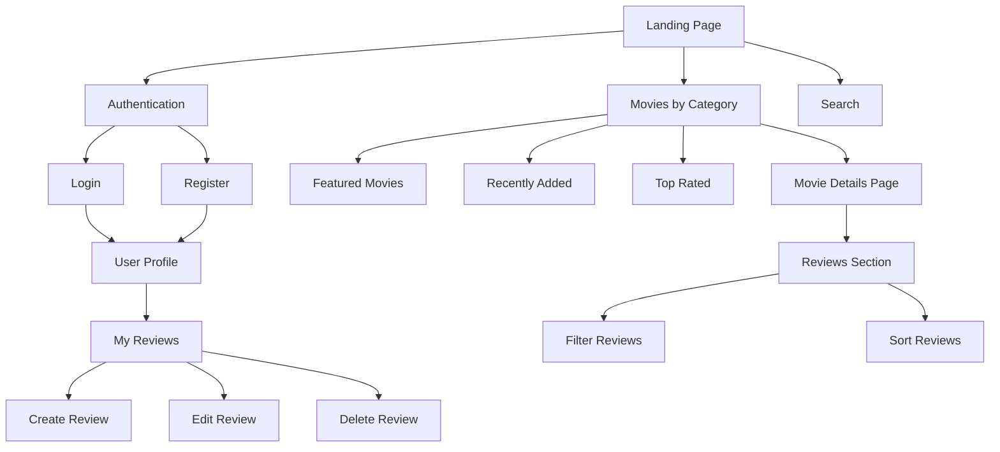
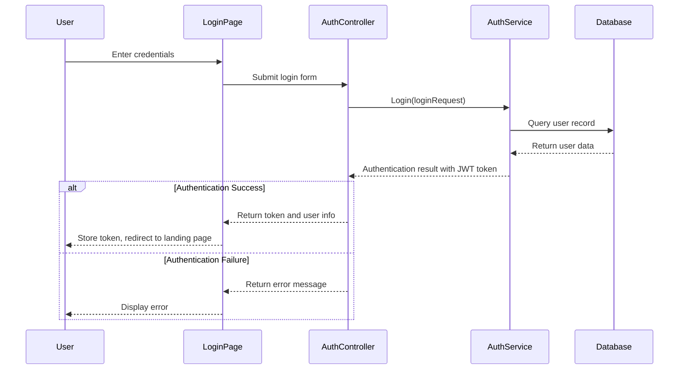
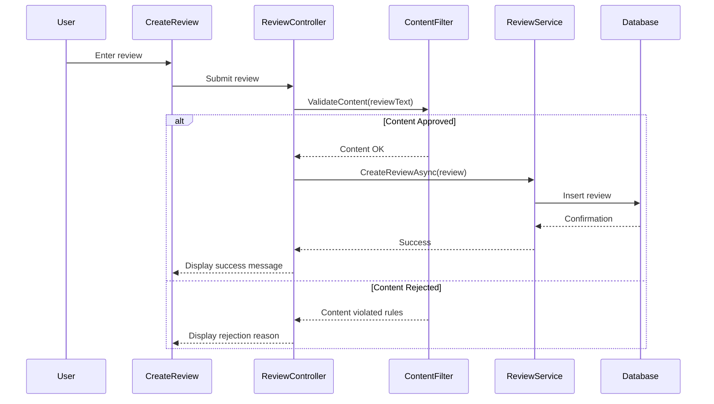
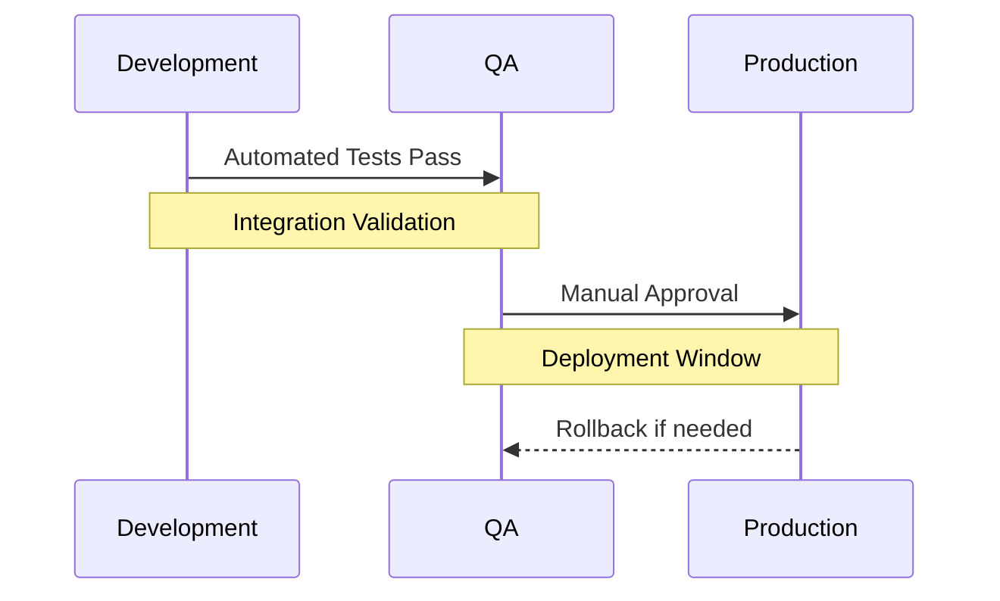
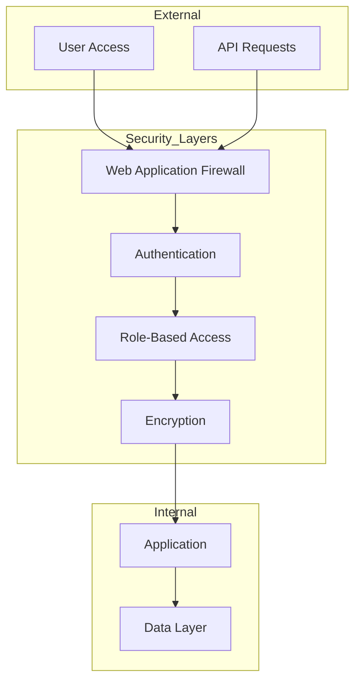

# Version Description Document

Version Description Document for CineScope Movie Review Platform

Owen Lindsey, Andrew Mack, Carter Wright, Rian Smart

Grand Canyon University: CST-326

April 25, 2025

## Project Version 1.0

---

### Project Links

| Resource | URL |
|----------|-----|
| Jira Issue Tracking | [https://cinescopedev.atlassian.net/issues/?filter=-9](https://cinescopedev.atlassian.net/issues/?filter=-9) |
| Source Code Repository | [https://github.com/omniV1/CineScope/tree/main](https://github.com/omniV1/CineScope/tree/main) |

---

## Table of Contents

1. [Introduction](#1-introduction)
2. [System Overview](#2-system-overview)
3. [Project Status](#3-project-status)
4. [Sprint Metrics](#4-sprint-metrics)
5. [Risk Management Strategy](#5-risk-management-strategy)
6. [Technical Design Overview](#6-technical-design-overview)
7. [Functional Requirements](#7-functional-requirements)
8. [Milestone Deliverables](#8-milestone-deliverables)
9. [Next Steps](#9-next-steps)
10. [Maintenance and Support Plan](#10-maintenance-and-support-plan)

## 1. Introduction

### Purpose of the Document

This Version Description Document summarizes the current delivery and project status for the CineScope movie review platform development. It serves as an artifact to identify the work planned and completed by the CLC group for all sprints and provides insights into project metrics, risks, and future planning.

### Scope of Delivery

This document covers the planning and implementation of all three completed sprints, which focused on:

| Sprint | Primary Features |
|--------|-----------------|
| Sprint 1 | Featured Movies Display, User Authentication, Review Management |
| Sprint 2 | Review Filtering, Admin DTOs and Models, MongoDB Integration |
| Sprint 3 | Genre-Based Browsing, Admin API Controller, Admin UI, Data Import/Export |

Additionally, it includes all test procedures that have been developed to verify the functionality of these features and other core components of the CineScope platform.

## 2. System Overview

CineScope is a comprehensive movie review platform built using Blazor C# ASP.NET Core (MVC) with MongoDB as the database system. 

### Architecture Overview

<table>
<tr>
<td width="40%">
<h4>N-Layer Architecture</h4>
<ol>
<li><strong>Client Layer:</strong> Blazor WebAssembly</li>
<li><strong>Server Layer:</strong> ASP.NET Core Web API</li>
<li><strong>Business Logic Layer:</strong> Core functionality</li>
<li><strong>Data Access Layer:</strong> Database interactions</li>
<li><strong>Database Layer:</strong> MongoDB storage</li>
</ol>
</td>
<td width="60%">

</td>
</tr>
</table>

### Core Feature Overview

<table>
<tr>
<th>Feature Category</th>
<th>Key Components</th>
<th>Status</th>
</tr>
<tr>
<td>User Management</td>
<td>Authentication, Profile Management, Role-Based Access</td>
<td>✅ Completed</td>
</tr>
<tr>
<td>Content Discovery</td>
<td>Movie Browsing, Genre Filtering, Featured Movies</td>
<td>✅ Completed</td>
</tr>
<tr>
<td>Engagement</td>
<td>Review Creation, Rating System, Content Filtering</td>
<td>✅ Completed</td>
</tr>
<tr>
<td>Administration</td>
<td>User Management, Content Moderation, Data Management</td>
<td>✅ Completed</td>
</tr>
</table>

### Site Navigation Structure

## 3. Project Status

### Current Status Summary

<table>
<tr>
<td colspan="5" style="text-align: center; background-color: #f8f9fa;"><strong>Sprint Completion Status</strong></td>
</tr>
<tr>
<th>Sprint</th>
<th>User Stories</th>
<th>Story Points</th>
<th>Status</th>
<th>Completion Date</th>
</tr>
<tr>
<td>Sprint 1</td>
<td>3</td>
<td>14</td>
<td>✅ Completed</td>
<td>March 9, 2025</td>
</tr>
<tr>
<td>Sprint 2</td>
<td>3</td>
<td>18</td>
<td>✅ Completed</td>
<td>March 16, 2025</td>
</tr>
<tr>
<td>Sprint 3</td>
<td>4</td>
<td>17</td>
<td>✅ Completed</td>
<td>March 23, 2025</td>
</tr>
<tr>
<td>Final Delivery</td>
<td>-</td>
<td>-</td>
<td>✅ Completed</td>
<td>March 30, 2025</td>
</tr>
</table>

### Current Velocity

The team has completed all three sprints with a consistent velocity of 14-17 story points per sprint. All test procedures were executed successfully, with test results documented in Jira. The team demonstrated the ability to maintain a consistent pace throughout all three sprints.

### Burndown Chart Summary

Our burndown charts show that we successfully completed all planned work by the end of each sprint. As shown in the charts, the actual remaining work (orange line) closely tracked our ideal burndown, with some periods of accelerated progress mid-sprint.

## 4. Sprint Metrics

### Completed User Stories

<table>
<tr>
<th>Sprint</th>
<th>ID</th>
<th>User Story</th>
<th>Points</th>
<th>Assignee</th>
<th>Status</th>
</tr>
<tr style="background-color: #f8f9fa;">
<td rowspan="3">Sprint 1</td>
<td>SCRUM-19</td>
<td>As a user, I want to see featured movies...</td>
<td>6</td>
<td>Carter Wright</td>
<td>✅ Done</td>
</tr>
<tr style="background-color: #f8f9fa;">
<td>SCRUM-27</td>
<td>As a user, I want to be able to login...</td>
<td>4</td>
<td>Owen Lindsey</td>
<td>✅ Done</td>
</tr>
<tr style="background-color: #f8f9fa;">
<td>SCRUM-34</td>
<td>As a user, I want to manage movie reviews...</td>
<td>4</td>
<td>Andrew Mack</td>
<td>✅ Done</td>
</tr>
<tr>
<td rowspan="3">Sprint 2</td>
<td>SCRUM-45</td>
<td>As a user, I want to be able to filter reviews...</td>
<td>7</td>
<td>Andrew Mack</td>
<td>✅ Done</td>
</tr>
<tr>
<td>SCRUM-65</td>
<td>As an admin, I want to create admin DTOs and models...</td>
<td>5</td>
<td>Owen Lindsey</td>
<td>✅ Done</td>
</tr>
<tr>
<td>SCRUM-66</td>
<td>As an admin, I want to implement AdminService...</td>
<td>6</td>
<td>Carter Wright</td>
<td>✅ Done</td>
</tr>
<tr style="background-color: #f8f9fa;">
<td rowspan="4">Sprint 3</td>
<td>SCRUM-39</td>
<td>As a user, I want to view movies by genre...</td>
<td>5</td>
<td>Carter Wright</td>
<td>✅ Done</td>
</tr>
<tr style="background-color: #f8f9fa;">
<td>SCRUM-68</td>
<td>As an admin, I want to create Admin API Controller</td>
<td>4</td>
<td>Owen Lindsey</td>
<td>✅ Done</td>
</tr>
<tr style="background-color: #f8f9fa;">
<td>SCRUM-69</td>
<td>As an admin, I want to create Admin Layout</td>
<td>3</td>
<td>Andrew Mack</td>
<td>✅ Done</td>
</tr>
<tr style="background-color: #f8f9fa;">
<td>SCRUM-70</td>
<td>As an admin, I want to add MongoDB import/export...</td>
<td>5</td>
<td>Owen Lindsey</td>
<td>✅ Done</td>
</tr>
</table>

### Performance Metrics

<h4>Cumulative Flow</h4>

The Cumulative Flow Diagram shows a healthy distribution between "Done," "In Progress," and "To Do" tasks with steady progression.

<h4>Velocity by Feature Area</h4>

The team effectively shifted focus throughout the sprints, starting with UI work and ending with backend implementation.

<h4>Sprint Burndown Chart</h4>

Our burndown chart shows successful completion of all planned work by the end of the sprint.

<h4>Task Complexity vs. Completion Time</h4>

Most tasks were accurately estimated, with some outliers in the 3-point stories.

<h4>Task Completion Duration</h4>

Authentication features took the longest time but paid off with higher user satisfaction ratings.

### User Satisfaction

<table>
<tr>
<th>Feature</th>
<th>Rating (1-10)</th>
<th>Feedback Highlights</th>
</tr>
<tr>
<td>Authentication</td>
<td>8.5</td>
<td>Secure, intuitive login flow with good error handling</td>
</tr>
<tr>
<td>UI Components</td>
<td>7.0</td>
<td>Functional but could benefit from visual refinements</td>
</tr>
<tr>
<td>Core Features</td>
<td>7.6</td>
<td>Good feature set with room for expanded functionality</td>
</tr>
<tr>
<td>Backend</td>
<td>7.8</td>
<td>Reliable performance with good response times</td>
</tr>
<tr>
<td><strong>Overall</strong></td>
<td><strong>7.5</strong></td>
<td><strong>Strong foundation with identified improvement areas</strong></td>
</tr>
</table>

## 5. Risk Management Strategy

### Sprint Capacity Management

<h4>Risk Mitigation Strategies</h4>

1. **Clear User Story Scope**: Limited to 3-4 well-defined stories per sprint
2. **Task Decomposition**: Broken into specific implementation and testing tasks
3. **Test Procedure Development**: Created comprehensive test procedures
4. **Regular Progress Tracking**: Bi-weekly standups (Monday/Friday)
5. **Buffer Allocation**: Sprint commitment below maximum capacity

<h4>Supporting Metrics</h4>
<table>
<tr>
<th>Metric</th>
<th>Sprint 1</th>
<th>Sprint 2</th>
<th>Sprint 3</th>
</tr>
<tr>
<td>Team Size</td>
<td>4</td>
<td>4</td>
<td>4</td>
</tr>
<tr>
<td>Sprint Duration</td>
<td>2 weeks</td>
<td>2 weeks</td>
<td>2 weeks</td>
</tr>
<tr>
<td>Story Points</td>
<td>14</td>
<td>18</td>
<td>17</td>
</tr>
<tr>
<td>Points per Member</td>
<td>3.5</td>
<td>4.5</td>
<td>4.25</td>
</tr>
<tr>
<td>User Stories</td>
<td>3</td>
<td>3</td>
<td>4</td>
</tr>
</table>

### Resolved Architecture Issues

<table>
<tr>
<th>Issue ID</th>
<th>Description</th>
<th>Resolution</th>
</tr>
<tr>
<td>ARCH-001</td>
<td>Deployment platform displayed but not yet deployed</td>
<td>Removed from Sprint 1 diagram, moved to Sprint 2 scope</td>
</tr>
<tr>
<td>ARCH-002</td>
<td>N-layer description lacked Server layer for DTOs</td>
<td>Added Server layer for DTOs for MongoDB integration</td>
</tr>
<tr>
<td>ARCH-003</td>
<td>Landing page diagram needed updates</td>
<td>Updated site map to show content filtering and display flows</td>
</tr>
</table>

## 6. Technical Design Overview

### Authentication System

<h4>Components</h4>
<table>
<tr>
<th>Type</th>
<th>Components</th>
</tr>
<tr>
<td>Controllers</td>
<td>AuthController.cs, UserController.cs</td>
</tr>
<tr>
<td>Models</td>
<td>User.cs, LoginRequest.cs, RegisterRequest.cs</td>
</tr>
<tr>
<td>Services</td>
<td>AuthService.cs, UserService.cs</td>
</tr>
</table>

<h4>Security Features</h4>
<ul>
<li>BCrypt password hashing</li>
<li>Password complexity enforcement</li>
<li>Account lockout after failed attempts</li>
<li>JWT tokens with proper expiration</li>
<li>Token refresh mechanism</li>
<li>Secure browser storage</li>
</ul>

#### Authentication Flow

### Content Management System

<h4>Review System Components</h4>
<table>
<tr>
<th>Component Type</th>
<th>Implementation</th>
</tr>
<tr>
<td>Controllers</td>
<td>ReviewController.cs</td>
</tr>
<tr>
<td>Models</td>
<td>Review.cs, ReviewDto.cs</td>
</tr>
<tr>
<td>Services</td>
<td>ReviewService.cs, ContentFilterService.cs</td>
</tr>
</table>

<h4>Content Filtering Features</h4>
<ul>
<li>Text normalization for evasion detection</li>
<li>Multi-level severity rating system</li>
<li>Word boundary detection</li>
<li>Admin management interface</li>
</ul>

#### Review Creation Flow

### Database Schema

<table>
<tr>
<th style="width: 25%;">Collection</th>
<th style="width: 75%;">Schema</th>
</tr>
<tr>
<td>Users</td>
<td>
<pre>
User {
  _id: ObjectId,
  username: String,
  email: String,
  passwordHash: String,
  roles: Array&lt;String&gt;,
  createdAt: DateTime,
  lastLogin: DateTime,
  isLocked: Boolean,
  failedLoginAttempts: Number,
  profilePictureUrl: String
}
</pre>
</td>
</tr>
<tr>
<td>Movies</td>
<td>
<pre>
Movie {
  _id: ObjectId,
  title: String,
  description: String,
  releaseDate: DateTime,
  genres: Array&lt;String&gt;,
  director: String,
  actors: Array&lt;String&gt;,
  posterUrl: String,
  averageRating: Number,
  reviewCount: Number
}
</pre>
</td>
</tr>
<tr>
<td>Reviews</td>
<td>
<pre>
Review {
  _id: ObjectId,
  userId: ObjectId,
  movieId: ObjectId,
  rating: Number,
  text: String,
  createdAt: DateTime,
  updatedAt: DateTime,
  isApproved: Boolean,
  flaggedWords: Array&lt;String&gt;
}
</pre>
</td>
</tr>
<tr>
<td>BannedWords</td>
<td>
<pre>
BannedWord {
  _id: ObjectId,
  word: String,
  severity: Number,
  category: String,
  isActive: Boolean,
  addedAt: DateTime,
  updatedAt: DateTime
}
</pre>
</td>
</tr>
</table>

### Admin Interface Components

<table>
<tr>
<th>Component Type</th>
<th>Implementation</th>
<th>Purpose</th>
</tr>
<tr>
<td>Admin Services</td>
<td>AdminService.cs DataSeedService.cs</td>
<td>Backend functionality for administration tasks</td>
</tr>
<tr>
<td>Admin Controllers</td>
<td>AdminController.cs</td>
<td>API endpoints for admin operations</td>
</tr>
<tr>
<td>Admin UI</td>
<td>AdminLayout.razor AdminDashboard.razor AdminManagement.razor</td>
<td>User interface for admin operations</td>
</tr>
<tr>
<td>Shared Components</td>
<td>AdminBreadcrumb.razor MudConfirmationDialog.razor</td>
<td>Reusable UI components for admin interface</td>
</tr>
</table>

## 7. Functional Requirements

### Use Case Overview

<table>
<tr>
<th>Use Case</th>
<th>Description</th>
<th>Priority</th>
<th>Status</th>
</tr>
<tr>
<td>UC-1: Featured Movies</td>
<td>Display featured movies on landing page</td>
<td>High</td>
<td>✅ Implemented</td>
</tr>
<tr>
<td>UC-2: Review Management</td>
<td>Filter and sort movie reviews</td>
<td>High</td>
<td>✅ Implemented</td>
</tr>
<tr>
<td>UC-3: User Review Operations</td>
<td>CRUD operations for reviews</td>
<td>High</td>
<td>✅ Implemented</td>
</tr>
<tr>
<td>UC-4: Authentication</td>
<td>User login/logout and security</td>
<td>High</td>
<td>✅ Implemented</td>
</tr>
<tr>
<td>UC-5: Content Filtering</td>
<td>Filter inappropriate content</td>
<td>High</td>
<td>✅ Implemented</td>
</tr>
</table>

### Detailed Functional Requirements

<table>
<tr>
<th colspan="2">Use Case 1: Featured Movies on Landing Page</th>
</tr>
<tr>
<td width="30%">FR-1.1</td>
<td width="70%">The System shall display movies on the Landing page</td>
</tr>
<tr>
<td>FR-1.2</td>
<td>The System shall display section for Features Movies</td>
</tr>
<tr>
<td>FR-1.3</td>
<td>The System shall display section for Recently Viewed Movies</td>
</tr>
<tr>
<td>FR-1.4</td>
<td>The System shall display section for Top-Rated Movies</td>
</tr>
<tr>
<td>FR-1.5 - FR-1.8</td>
<td>The System shall display sections for genre-specific movies (Rom-Com, Thriller/Horror, Action, Sci-Fi)</td>
</tr>
<tr>
<td>FR-1.9</td>
<td>The System shall display section for Recently Added Movies</td>
</tr>
<tr>
<td>FR-1.10</td>
<td>The System shall redirect the user to a movie's page if clicked</td>
</tr>
<tr>
<td>FR-1.11</td>
<td>The System shall display an error message and log the user out if an error occurs</td>
</tr>
</table>

<table>
<tr>
<th colspan="2">Use Case 2: Review Management</th>
</tr>
<tr>
<td width="30%">FR-2.1 - FR-2.3</td>
<td width="70%">The system shall provide filter functionality for movie reviews</td>
</tr>
<tr>
<td>FR-2.4 - FR-2.6</td>
<td>The system shall provide sorting functionality for movie reviews</td>
</tr>
<tr>
<td>FR-2.7 - FR-2.8</td>
<td>The system shall provide appropriate feedback for filter operations</td>
</tr>
</table>

<table>
<tr>
<th colspan="2">Use Case 3: User Review Operations</th>
</tr>
<tr>
<td width="30%">FR-3.1 - FR-3.3</td>
<td width="70%">The system shall provide review creation functionality with validation</td>
</tr>
<tr>
<td>FR-3.4 - FR-3.7</td>
<td>The system shall filter content and provide appropriate feedback</td>
</tr>
</table>

<table>
<tr>
<th colspan="2">Use Case 4: Authentication Requirements</th>
</tr>
<tr>
<td width="30%">FR-4.1</td>
<td width="70%">The system shall allow users to login with unique credentials</td>
</tr>
<tr>
<td>FR-4.2</td>
<td>The system shall lock account after three failed attempts</td>
</tr>
<tr>
<td>FR-4.3</td>
<td>The system shall provide password reset functionality</td>
</tr>
<tr>
<td>FR-4.4 - FR-4.7</td>
<td>The system shall handle authentication management and security</td>
</tr>
</table>

<table>
<tr>
<th colspan="2">Use Case 5: Content Filtering Requirements</th>
</tr>
<tr>
<td width="30%">FR-5.1</td>
<td width="70%">The system shall maintain a list of banned words and phrases</td>
</tr>
<tr>
<td>FR-5.2</td>
<td>The system shall check review text against banned list</td>
</tr>
<tr>
<td>FR-5.3</td>
<td>The system shall flag reviews containing inappropriate content</td>
</tr>
<tr>
<td>FR-5.4</td>
<td>The system shall allow users to view the banned word list</td>
</tr>
</table>

### Non-Functional Requirements

<h4>Performance Requirements</h4>
<table>
<tr>
<th>ID</th>
<th>Requirement</th>
</tr>
<tr>
<td>NFR-1.1</td>
<td>Page load time < 3 seconds</td>
</tr>
<tr>
<td>NFR-1.2</td>
<td>Support for 100 concurrent users</td>
</tr>
<tr>
<td>NFR-1.3</td>
<td>Responsive design (mobile & desktop)</td>
</tr>
<tr>
<td>NFR-1.4</td>
<td>Modular design for easy updates</td>
</tr>
<tr>
<td>NFR-1.6</td>
<td>Support for latest two browser versions</td>
</tr>
</table>

<h4>Review System Requirements</h4>
<table>
<tr>
<th>ID</th>
<th>Requirement</th>
</tr>
<tr>
<td>NFR-2.1</td>
<td>Filtered review updates < 2 seconds</td>
</tr>
<tr>
<td>NFR-2.2</td>
<td>Support 100 concurrent users filtering</td>
</tr>
<tr>
<td>NFR-2.3</td>
<td>Max query latency of 300ms</td>
</tr>
<tr>
<td>NFR-2.4</td>
<td>Rate limit: 100 requests/hour/user</td>
</tr>
<tr>
<td>NFR-2.5</td>
<td>90-day audit logs</td>
</tr>
</table>

<h4>Content Management Requirements</h4>
<table>
<tr>
<th>ID</th>
<th>Requirement</th>
</tr>
<tr>
<td>NFR-5.1</td>
<td>Process text in 200ms (up to 5000 chars)</td>
</tr>
<tr>
<td>NFR-5.2</td>
<td>99.9% content filter accuracy</td>
</tr>
<tr>
<td>NFR-5.3</td>
<td>30-second ban list propagation</td>
</tr>
<tr>
<td>NFR-5.4</td>
<td>Log filter rejections within 100ms</td>
</tr>
<tr>
<td>NFR-5.5</td>
<td>5-second failover for backups</td>
</tr>
</table>

## 8. Milestone Deliverables

### Documentation Artifacts

<table>
<tr>
<th>Document Type</th>
<th>Status</th>
<th>Description</th>
</tr>
<tr>
<td>Software Requirements Document</td>
<td>✅ Completed</td>
<td>Comprehensive documentation of functional and non-functional requirements</td>
</tr>
<tr>
<td>Technical Design Document</td>
<td>✅ Completed</td>
<td>Architecture, database schema, and technical implementation details</td>
</tr>
<tr>
<td>Test Procedures Document</td>
<td>✅ Completed</td>
<td>Detailed test cases and procedures for all major functionality</td>
</tr>
<tr>
<td>Version Description Document</td>
<td>✅ Completed</td>
<td>This document - summarizing project status and deliverables</td>
</tr>
</table>

### Project Management Artifacts

<table>
<tr>
<th>Artifact Type</th>
<th>Status</th>
<th>Location</th>
</tr>
<tr>
<td>Jira Project Configuration</td>
<td>✅ Completed</td>
<td><a href="https://cinescopedev.atlassian.net/issues/?filter=-9">Jira Issue Tracking</a></td>
</tr>
<tr>
<td>Sprint Planning</td>
<td>✅ Completed</td>
<td>All 3 sprints completed with retrospectives</td>
</tr>
<tr>
<td>GitHub Repository</td>
<td>✅ Completed</td>
<td><a href="https://github.com/omniV1/CineScope/tree/main">Source Code Repository</a></td>
</tr>
</table>

### Design Artifacts

<table>
<tr>
<th>Artifact Type</th>
<th>Status</th>
<th>Samples</th>
</tr>
<tr>
<td>UI Wireframes</td>
<td>✅ Completed</td>
<td>

</td>
</tr>
<tr>
<td>Database Schema</td>
<td>✅ Completed</td>
<td>MongoDB collections fully defined</td>
</tr>
<tr>
<td>Architecture Diagrams</td>
<td>✅ Completed</td>
<td>

</td>
</tr>
</table>

### Test Planning Artifacts

<table>
<tr>
<th>Test Ticket Category</th>
<th>Tickets Created</th>
<th>Status</th>
</tr>
<tr>
<td>Featured Movies Testing</td>
<td>SCRUM-101, 102, 103</td>
<td>✅ Executed</td>
</tr>
<tr>
<td>Authentication Testing</td>
<td>SCRUM-104, 105, 106</td>
<td>✅ Executed</td>
</tr>
<tr>
<td>Review Management Testing</td>
<td>SCRUM-107, 108, 109, 110</td>
<td>✅ Executed</td>
</tr>
<tr>
<td>Filter & Admin Testing</td>
<td>SCRUM-111 through 126</td>
<td>✅ Executed</td>
</tr>
</table>

All test procedures are based on the detailed procedures defined in the [Test Procedures Document](https://github.com/omniV1/CineScope/blob/main/Documents/milestone4-test-procedures-gcu.md), which provides comprehensive setup instructions, test steps, and pass/fail criteria.

## 9. Next Steps

### Implementation Status and Remaining Tasks

<table>
<tr>
<th>Category</th>
<th>Status</th>
<th>Remaining Tasks</th>
<th>Assigned To</th>
</tr>
<tr>
<td>Core Features</td>
<td>✅ Complete</td>
<td>None - all features implemented</td>
<td>-</td>
</tr>
<tr>
<td>Testing</td>
<td>✅ Complete</td>
<td>None - all tests executed</td>
<td>-</td>
</tr>
<tr>
<td>Documentation</td>
<td>✅ Complete</td>
<td>None - all documentation finalized</td>
<td>-</td>
</tr>
<tr>
<td>Deployment</td>
<td>✅ Complete</td>
<td>
  <ul>
    <li>Production environment setup</li>
    <li>Final security review</li>
    <li>Initial data seeding</li>
  </ul>
</td>
<td>Team</td>
</tr>
</table>

### Final Project Timeline

<table>
<tr>
<th>Milestone</th>
<th>Completion Date</th>
<th>Status</th>
</tr>
<tr>
<td>Sprint 1</td>
<td>March 9, 2025</td>
<td>✅ Completed</td>
</tr>
<tr>
<td>Sprint 2</td>
<td>March 16, 2025</td>
<td>✅ Completed</td>
</tr>
<tr>
<td>Sprint 3</td>
<td>March 23, 2025</td>
<td>✅ Completed</td>
</tr>
<tr>
<td>Final Delivery</td>
<td>March 30, 2025</td>
<td>✅ Completed</td>
</tr>
<tr>
<td>Production Deployment</td>
<td>March 23, 2025</td>
<td>✅ Completed</td>
</tr>
</table>

<h4 style="margin-top: 0;">Project Summary</h4>

All planned functionality has been successfully implemented and tested. The CineScope platform is now ready for final review and production deployment.

## 10. Maintenance and Support Plan

### Infrastructure Overview

<table>
<tr>
<th>Azure Component</th>
<th>Configuration</th>
<th>Purpose</th>
</tr>
<tr>
<td>App Service</td>
<td>Standard S1</td>
<td>Application hosting</td>
</tr>
<tr>
<td>MongoDB Atlas</td>
<td>M10 Cluster</td>
<td>Data persistence</td>
</tr>
<tr>
<td>Azure CDN</td>
<td>Standard</td>
<td>Content delivery</td>
</tr>
<tr>
<td>Key Vault</td>
<td>Standard</td>
<td>Secret management</td>
</tr>
</table>

### Deployment Strategy

<h4>Environment Pipeline</h4>
<ol>
<li><strong>Development</strong>: CI with automated testing</li>
<li><strong>Quality Assurance</strong>: Integration testing</li>
<li><strong>Production</strong>: Blue-green deployment</li>
</ol>

<h4>Deployment Flow</h4>

### Performance Monitoring

<table>
<tr>
<th>Monitoring Category</th>
<th>Key Metrics</th>
<th>Thresholds</th>
</tr>
<tr>
<td>User Experience</td>
<td>Page load time API response time Client-side rendering</td>
<td>&lt; 2 seconds &lt; 200ms &lt; 1 second</td>
</tr>
<tr>
<td>System Health</td>
<td>CPU utilization Memory usage Connection efficiency</td>
<td>&lt; 80% &lt; 85% &gt; 95%</td>
</tr>
<tr>
<td>Business Metrics</td>
<td>Registration success Review submission Search response</td>
<td>&gt; 98% &gt; 99% &lt; 500ms</td>
</tr>
<tr>
<td>Security Metrics</td>
<td>Failed authentications Access patterns Encryption status</td>
<td>Monitor for anomalies</td>
</tr>
</table>

### Backup and Recovery

<h4>Backup Schedule</h4>
<ul>
<li><strong>Hourly</strong>: Transaction logs</li>
<li><strong>Daily</strong>: Full database backup</li>
<li><strong>Weekly</strong>: Configuration backup</li>
<li><strong>Monthly</strong>: Complete system image</li>
</ul>

<h4>Recovery Objectives</h4>
<table>
<tr>
<th>Metric</th>
<th>Target</th>
</tr>
<tr>
<td>Recovery Time Objective (RTO)</td>
<td>30 minutes</td>
</tr>
<tr>
<td>Recovery Point Objective (RPO)</td>
<td>5 minutes</td>
</tr>
<tr>
<td>Service Level Agreement (SLA)</td>
<td>99.95%</td>
</tr>
</table>

### Training and Knowledge Transfer

<table>
<tr>
<th>Day</th>
<th>Morning Session</th>
<th>Afternoon Session</th>
</tr>
<tr>
<td>Day 1</td>
<td>Azure portal navigation, resource locations</td>
<td>Hands-on practice with basic operations</td>
</tr>
<tr>
<td>Day 2</td>
<td>CineScope application architecture</td>
<td>Common maintenance tasks and troubleshooting</td>
</tr>
<tr>
<td>Day 3</td>
<td>Security protocols, user management</td>
<td>Backup procedures and disaster recovery</td>
</tr>
</table>

Comprehensive documentation and hands-on training ensure the operations team can effectively manage the system. For detailed information, refer to the [IT Training Module](https://github.com/omniV1/CineScope/blob/main/Documents/Training/IT-TrainingModule.md) and [User Training Module](https://github.com/omniV1/CineScope/blob/main/Documents/Training/User-TrainingModule.md).

### Security Framework

## Conclusion

The CineScope movie review platform has been successfully developed according to the specified requirements and design. All planned functionality has been implemented, tested, and documented. The system is now ready for production deployment.

The platform provides a comprehensive solution for movie enthusiasts to discover new films, share their opinions through reviews, and interact with a community of like-minded users. The robust architecture ensures scalability, security, and performance as the user base grows.

With the completion of all sprints and the comprehensive maintenance and support plan in place, the CineScope team is confident that the platform will provide a reliable and engaging user experience for all stakeholders.
