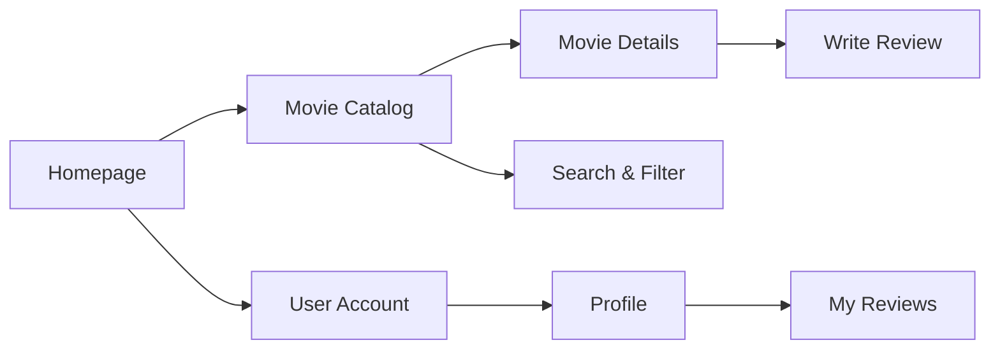
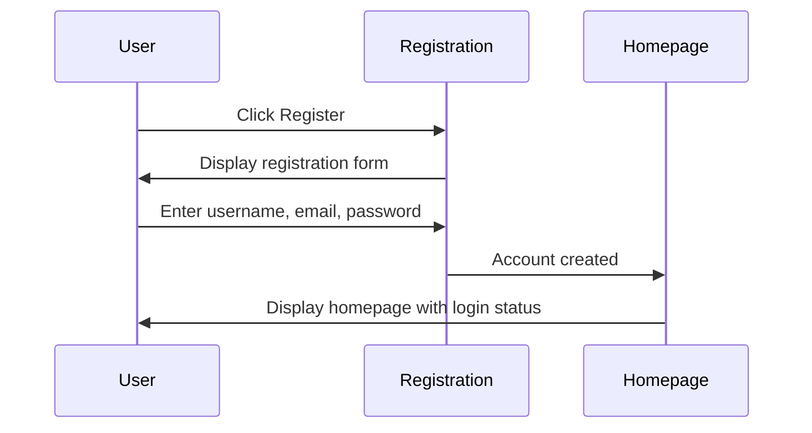
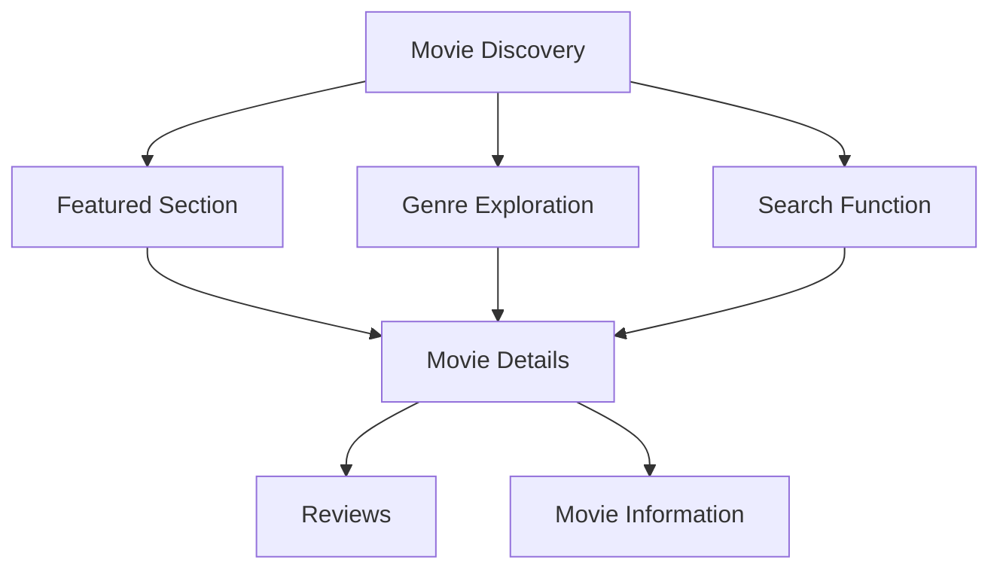
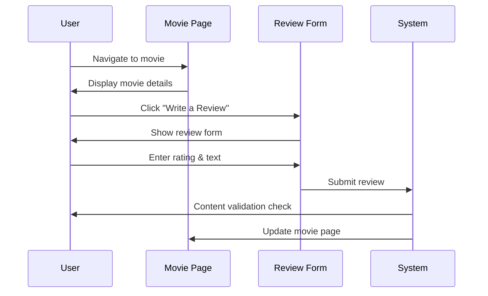
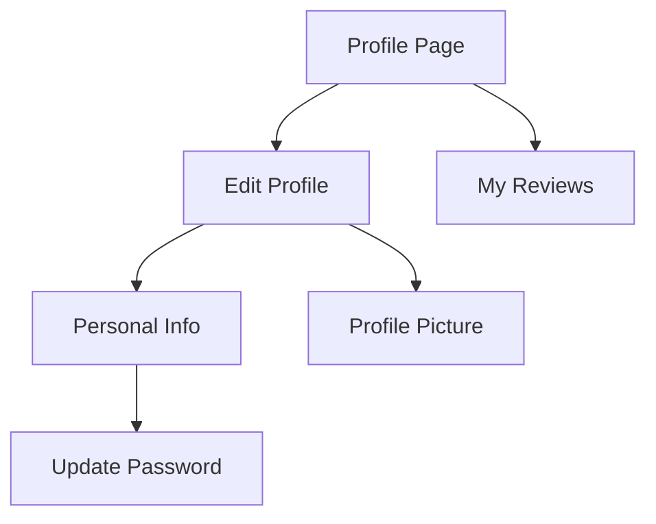
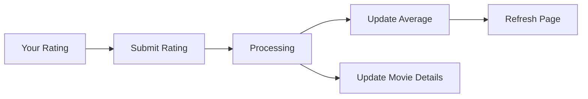
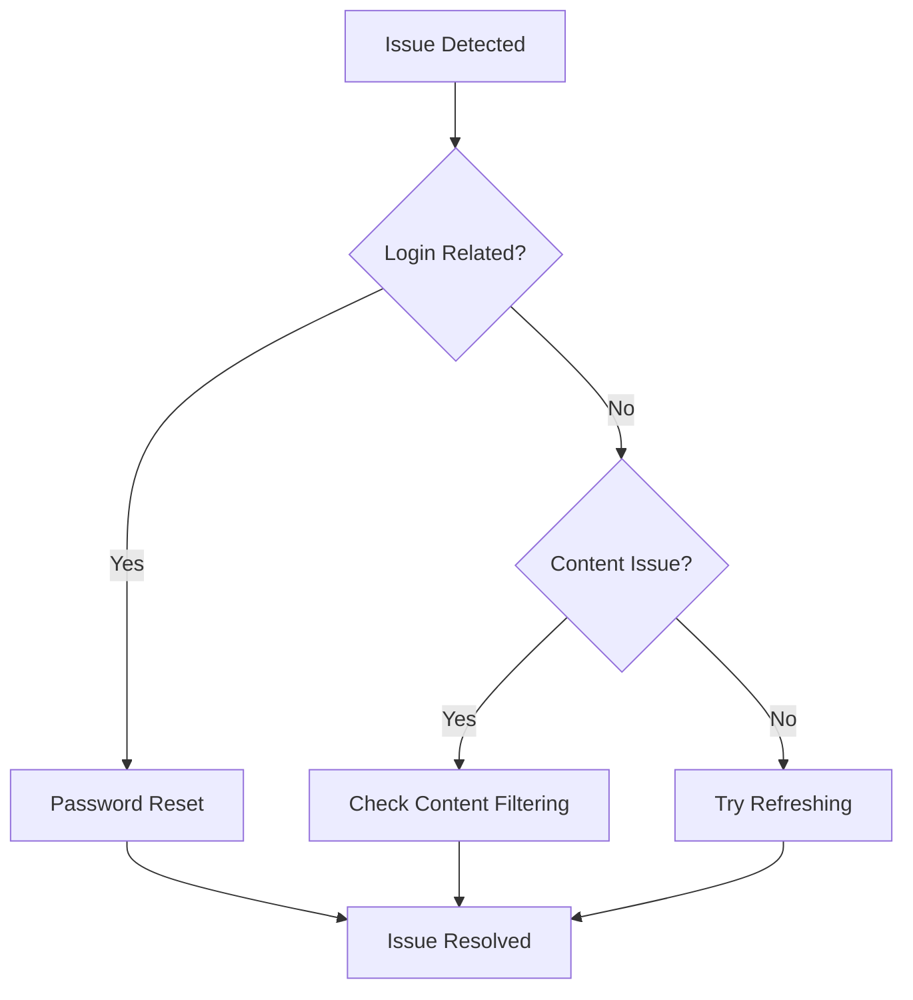
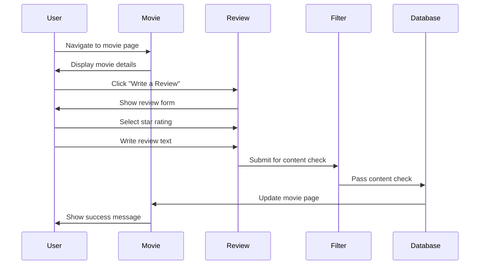
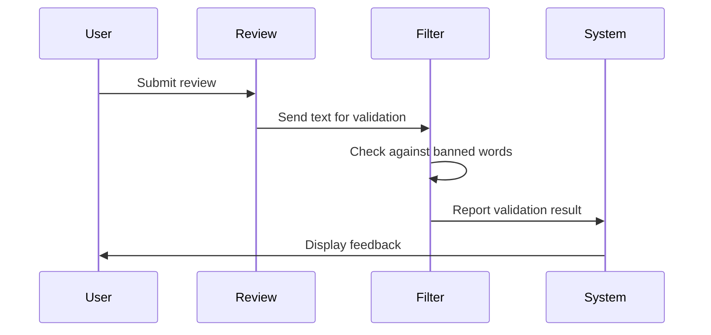

# CineScope User Guide

## Navigation Flow

## 1. Getting Started with CineScope

Welcome to CineScope, your destination for movie reviews and discussions. Let's start by understanding the platform's main features and how to navigate them.

### First-Time User Journey

When you first visit CineScope, the homepage presents a cinematic experience showcasing popular and recent titles. The navigation bar at the top provides quick access to all main features including Movies, Login, and Register options.

For account creation, click the "Register" button in the navigation bar. The registration process requires:
- A unique username (3-50 characters)
- Your email address (valid format required)
- A secure password (at least 6 characters)
- Password confirmation

After successful registration, you'll be automatically logged in and can begin exploring movies and writing reviews immediately.

## 2. Discovering Movies

### Search Process

Start your movie search from the Movies page using the search and filter options:

- Text-based queries: Enter movie titles in the search bar
- Genre selection: Use the dropdown menu to filter by genre
- Rating filter: Find movies above a certain rating threshold using the filters dialog
- Sort options: Sort by newest, oldest, highest-rated, or alphabetically

As you apply filters and search criteria, the movie list updates dynamically. Click on any movie card to go directly to that movie's details page.

## 3. Writing and Managing Reviews

### Creating Your First Review

When viewing a movie you'd like to review, follow these steps:

1. Navigate to the movie's detail page
2. Look for the "Write a Review" button below the movie information
3. In the review form, select your rating using the star system (1-5 stars)
4. Write your review in the text area provided (up to 1000 characters)
5. Submit when you're satisfied with your content

The system automatically checks your review for appropriate content using content filtering. If your review includes any prohibited words or phrases, you'll receive specific feedback about what needs to be changed.

## 4. Profile Customization

### Managing Your Profile

Your profile serves as your personal space within CineScope. To customize your profile:

1. Click your username or the profile icon in the navigation bar
2. Select "Profile" from the dropdown menu
3. From here you can:
   - Update your profile picture from predefined avatars
   - Change your username
   - Update your email address
   - Change your password (requires current password verification)

## 5. Understanding Ratings

The rating system combines user ratings to create an overall score for each movie. When you rate a movie:

1. Your individual rating (1-5 stars) is recorded
2. The system recalculates the movie's average rating
3. The movie's review count is updated
4. The details page reflects the new average rating and your review

## 6. Troubleshooting Common Issues

When encountering issues:

1. Check your internet connection
2. Try refreshing the page
3. Try logging out and back in
4. If content is being filtered, review for prohibited words

For login issues, ensure you're using the correct username and password. The application uses secure JWT authentication with token-based sessions.

## 7. Frequently Asked Questions

### Account Security

Q: How secure is my account information?
A: CineScope uses secure password hashing (BCrypt) and JWT token authentication to keep your account secure.

### Review Guidelines

Q: Why was my review not approved?
A: Reviews go through automated content filtering. If your review contains words that match our banned words list, you'll be notified of the specific terms that need revision.

### Technical Support

Q: The movie posters aren't loading properly. What should I do?
A: The system automatically tries alternative sources if the primary poster URL fails. You can also try refreshing the page or clearing your browser cache.

## 8. Review System

### Writing Reviews Process

### Review Management Options

When managing your reviews, you have several options:

1. Edit Review
   - Navigate to the movie page with your review
   - Click "Edit" on your review
   - Make changes to text or rating
   - Reviews pass through content filter again

2. Delete Review
   - Find review on movie page
   - Click "Delete"
   - Confirm deletion
   - System removes review and updates movie rating

3. Review History
   - Access all your reviews from "My Reviews" page
   - View by movie
   - Edit or delete reviews from this page

## 9. Content Filtering

### Filter System

The content filtering system checks reviews against a list of banned words. Each banned word has:
- A severity level (1-5)
- A category (e.g., Profanity, Hate Speech)
- Active status

If prohibited content is detected:
1. The review is not approved
2. You see a warning with the specific flagged words
3. You can edit your review to remove the problematic content

## 10. Admin Features

CineScope includes an admin panel for site management that's accessible only to users with the Admin role. This includes:

1. User Management
   - View all users
   - Filter by username, role, or status
   - Toggle admin privileges
   - Suspend or activate accounts

2. Content Moderation
   - Review flagged content
   - Approve, reject, or modify reviews
   - Manage banned word list
   - View content statistics

3. Movie Management
   - Add new movies
   - Edit existing movies
   - Update movie details and posters

To access admin features, a user must have the Admin role assigned to their account.