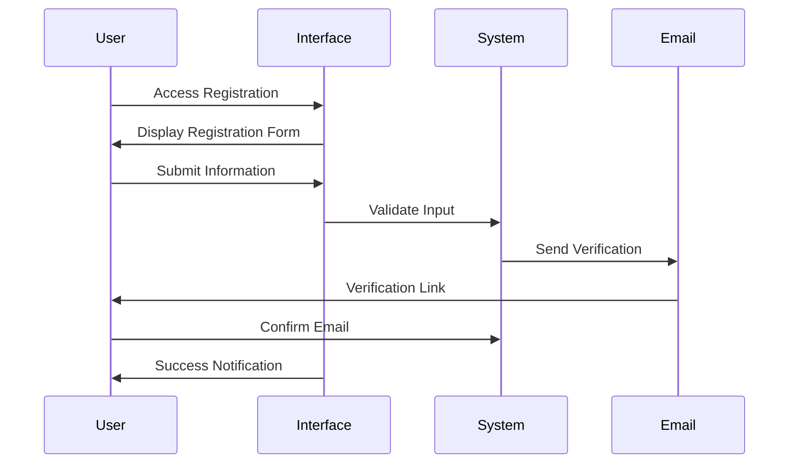
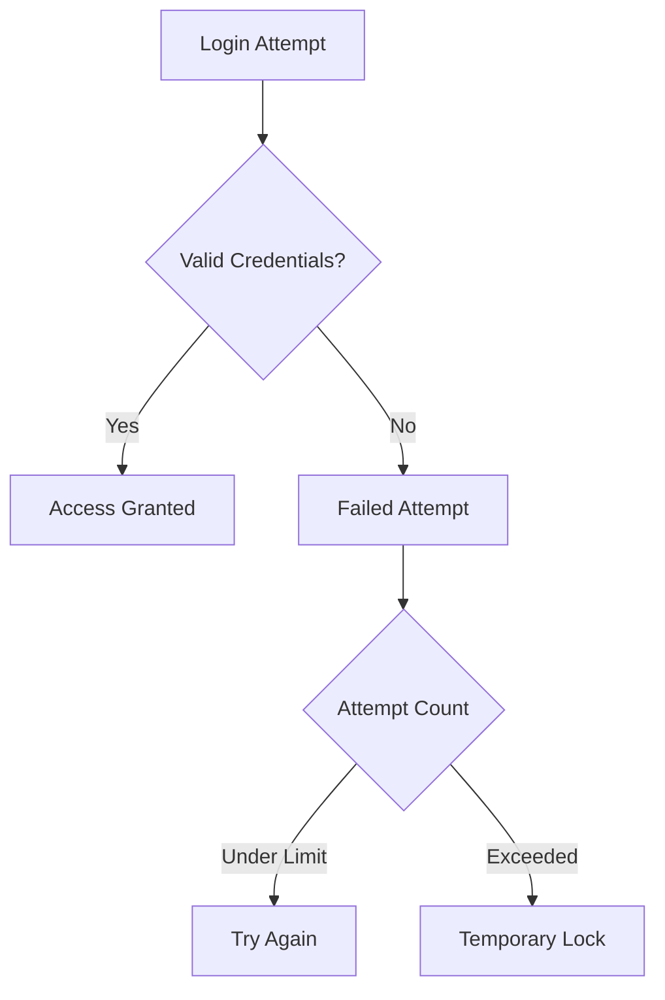
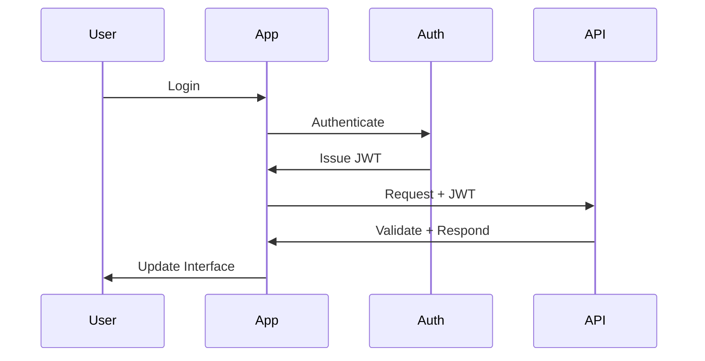

# CineScope Authentication & Authorization Training Module

## Getting Started with CineScope

The journey into CineScope begins with user registration, a process designed to be both welcoming and secure. New users will find a clean, intuitive registration page where they can create their account. The registration form requests essential information including a username, email address, and password. Our system guides users through each step, providing real-time feedback to ensure all information meets our security standards.

## Registration Process

When creating a password, the system ensures account security through comprehensive requirements. Passwords must be at least 8 characters long and include a mix of uppercase letters, lowercase letters, numbers, and special characters. As users type their password, a helpful indicator shows which requirements have been met, making it easy to create a strong, secure password.

## Email Verification

After submitting registration information, users will receive a verification email at their provided address. This email contains a secure verification link that remains valid for 24 hours. Clicking this link confirms the email address and activates the account. Should the verification link expire, users can easily request a new one through the verification page.

## Logging Into CineScope

The login process combines security with convenience. Users can access their accounts using either their username or email address, along with their password. For added convenience, the "Remember Me" option allows trusted devices to maintain secure access without frequent login prompts. If users forget their password, our recovery system provides a secure way to regain account access.

## Account Security

Account security remains a top priority at CineScope. The system monitors login attempts and temporarily locks accounts after three unsuccessful tries, protecting users from unauthorized access attempts. This lockout lasts for 15 minutes, after which users can attempt to log in again. For additional security, all account activities are monitored for suspicious behavior.

## Password Recovery

When users need to recover their password, our system provides a straightforward process. After clicking the "Forgot Password" link, users enter their email address to receive a password reset link. This secure link expires after 30 minutes and can only be used once. When creating a new password, users must meet the same security requirements as during registration, and the new password cannot match the previous one.

## Session Management

CineScope employs JWT (JSON Web Token) authentication to manage user sessions securely. When users log in, the system creates a secure token that remains valid for 24 hours. For users who choose "Remember Me," a refresh token extends this period to 7 days. The system automatically renews sessions during active use while maintaining security.

## User Access Levels

CineScope implements three distinct access levels to manage user permissions effectively. Anonymous visitors can browse the movie catalog, view details, and read public reviews. Upon registration and login, users gain the ability to write reviews, manage their profiles, and participate in the community. Administrative users receive additional capabilities for platform management, including content moderation and user administration.

## Security Guidelines

Maintaining account security requires attention to best practices. Users should create unique, strong passwords and avoid sharing credentials. When accessing CineScope from shared devices, users should log out after their session and clear browser data. The system helps maintain security by monitoring account activity and alerting users to unusual behavior.

## Support and Assistance

When users encounter access issues, our support team stands ready to help. Support is available through our help desk system during business hours. Common issues like missing verification emails or account lockouts can often be resolved through our self-service tools. For more complex matters, our support team provides personalized assistance to ensure users regain secure access to their accounts.
