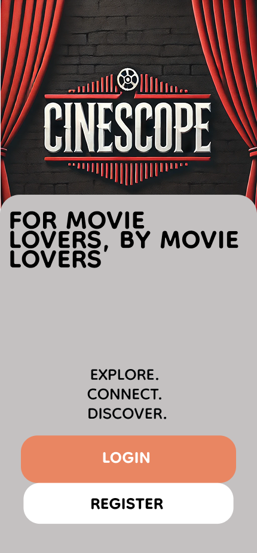
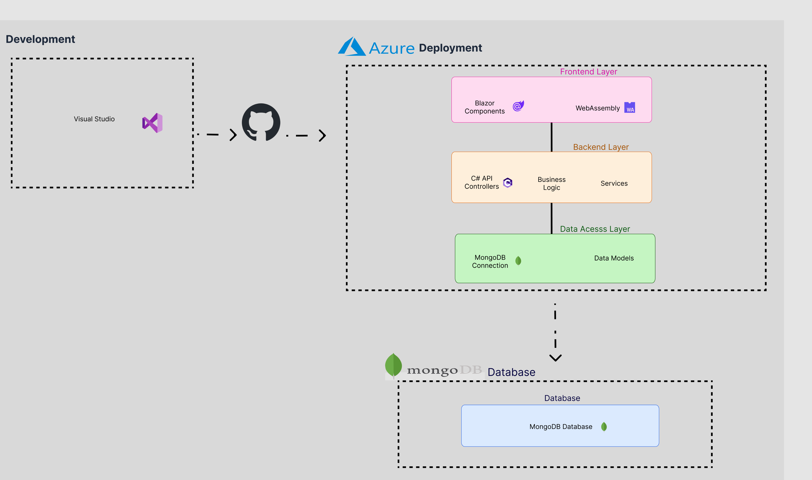

# CineScope Movie Review Platform



## For Movie Lovers, By Movie Lovers

CineScope is a modern, user-friendly movie review platform that enables movie enthusiasts to share their opinions and discover new films. Built using C# ASP.NET Core Blazor with MongoDB as the database system, the platform delivers a responsive web interface where users can browse movies by various categories, write and manage reviews, and interact with other users' content.

## Table of Contents
- [Features](#features)
- [System Architecture](#system-architecture)
- [Getting Started](#getting-started)
  - [Prerequisites](#prerequisites)
  - [Installation](#installation)
  - [Configuration](#configuration)
- [Usage](#usage)
- [Technologies Used](#technologies-used)
- [Project Structure](#project-structure)
- [API Documentation](#api-documentation)
- [Development Team](#development-team)
- [Contributing](#contributing)
- [License](#license)

## Features

- **User Authentication**: Secure login/registration system with advanced security features
- **Movie Browsing**: Browse films by category, rating, release date and more
- **Review Management**: Create, read, update, and delete your movie reviews
- **Content Filtering**: Automatic moderation of user-submitted content
- **Responsive Design**: Seamless experience across desktop and mobile devices
- **Admin Dashboard**: Comprehensive admin interface for content moderation and user management

## System Architecture

CineScope follows an N-layer architecture:



- **Client Layer**: Blazor WebAssembly application running in the browser
- **Server Layer**: ASP.NET Core Web API with controller endpoints
- **Service Layer**: Business logic implementation with services
- **Data Access Layer**: MongoDB data repositories
- **Database Layer**: MongoDB database for data storage

## Getting Started

### Prerequisites

- [.NET 8.0 SDK](https://dotnet.microsoft.com/download/dotnet/8.0)
- [MongoDB](https://www.mongodb.com/try/download/community) (local) or [MongoDB Atlas](https://www.mongodb.com/cloud/atlas) (cloud)
- [Visual Studio 2022](https://visualstudio.microsoft.com/vs/) or [Visual Studio Code](https://code.visualstudio.com/)
- [Git](https://git-scm.com/downloads)

### Installation

1. Clone the repository:
   ```bash
   git clone https://github.com/omniV1/CineScope.git
   cd CineScope
   ```

2. Restore dependencies:
   ```bash
   dotnet restore
   ```

3. Build the solution:
   ```bash
   dotnet build
   ```

4. Navigate to the Server project directory:
   ```bash
   cd Source/CineScope/Server
   ```

5. Run the application:
   ```bash
   dotnet run
   ```

### Configuration

1. Configure MongoDB connection in `appsettings.json`:
   ```json
   "MongoDbSettings": {
     "ConnectionString": "mongodb://localhost:27017",
     "DatabaseName": "CineScopeDb",
     "UsersCollectionName": "Users",
     "MoviesCollectionName": "Movies",
     "ReviewsCollectionName": "Reviews",
     "BannedWordsCollectionName": "BannedWords"
   }
   ```

2. Configure JWT settings for authentication:
   ```json
   "JwtSettings": {
     "Secret": "your-secret-key-at-least-32-characters",
     "Issuer": "cinescope",
     "Audience": "cinescope-client",
     "ExpiryMinutes": 60
   }
   ```

## Usage

After running the application, navigate to `https://localhost:7136` in your browser (or the port specified in your configuration). 

- **Browse Movies**: View featured, top-rated, and recently added movies on the landing page
- **Register/Login**: Create an account or log in to access personalized features
- **Write Reviews**: Share your thoughts on movies with ratings and detailed reviews
- **Manage Content**: Admin users can moderate content and manage the platform

## Technologies Used

- **Frontend**: Blazor WebAssembly, MudBlazor UI components
- **Backend**: C# ASP.NET Core, .NET 8.0
- **Database**: MongoDB
- **Authentication**: JWT (JSON Web Tokens)
- **CI/CD**: Azure DevOps
- **Cloud**: Azure App Service, MongoDB Atlas

## Project Structure

```
CineScope/
├── Documents/                  # Documentation files
│   ├── Help/                   # Guides and training materials
│   ├── Images/                 # Wireframes and diagrams
│   ├── Requirements/           # Functional and non-functional requirements
│   ├── Technical-Reports/      # Technical design and documentation
│   └── Training/               # Training modules
├── Source/                     # Source code
│   └── CineScope/              # Main application
│       ├── Client/             # Blazor WebAssembly client application
│       │   ├── Components/     # Reusable UI components
│       │   ├── Pages/          # Application pages
│       │   └── Shared/         # Shared layouts and components
│       ├── Server/             # ASP.NET Core server application
│       │   ├── Controllers/    # API endpoints
│       │   ├── Models/         # Data models
│       │   ├── Services/       # Business logic services
│       │   └── Repositories/   # Data access layer
│       └── Shared/             # Shared code between Client and Server
├── Tests/                      # Test projects
│   ├── CineScope.Tests.Unit/          # Unit tests
│   └── CineScope.Tests.Integration/   # Integration tests
└── README.md                   # This file
```

## API Documentation

The API documentation is available via Swagger when running the application in development mode. Navigate to `https://localhost:7136/swagger` to explore the available endpoints.

Key API endpoints include:
- `/api/auth` - Authentication endpoints
- `/api/movie` - Movie data endpoints
- `/api/review` - Review management endpoints
- `/api/admin` - Admin functionality (restricted access)

## Development Team

| Name | Role | Department |
|------|------|------------|
| Carter Wright | Scrum Master | Development |
| Rian Smart | Product Owner | Management |
| Owen Lindsey | Developer | Development |
| Andrew Mack | Developer | Development |

## Contributing

1. Fork the repository
2. Create a feature branch (`git checkout -b feature/your-feature-name`)
3. Commit your changes (`git commit -m 'Add some feature'`)
4. Push to the branch (`git push origin feature/your-feature-name`)
5. Open a Pull Request

Please refer to our [contribution guidelines](CONTRIBUTING.md) for more details.

## License

This project is licensed under the MIT License - see the [LICENSE](LICENSE) file for details.
