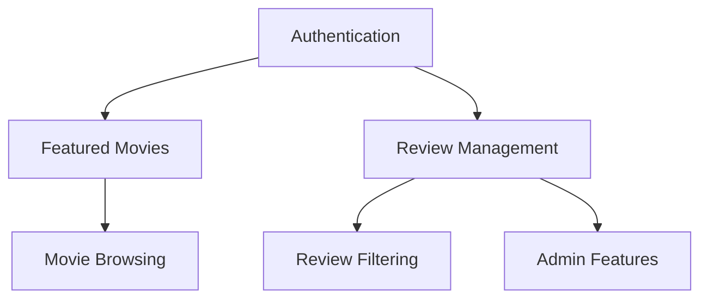

# CineScope User Stories

## Overview

These user stories will be broken into tasks in Jira and will comprise our goals for sprint 1. Each story follows the format: As a [who], I want [what] so that [why], providing clear direction for our development efforts.

## Core Stories Matrix

| ID | User Story | Functionality | Priority | Notes |
|----|------------|--------------|----------|--------|
| 1 | As a user, I want to see featured movies on the landing page | Featured Movies Display | HIGH | Color scheme: Purple and white, Display 3 most recent movies |
| 2 | As a user, I want to manage movie reviews so I can share my opinions | Movie Review Functionality | HIGH | Find unique theme, reflect current design trends |
| 3 | As a user, I want to be able to filter reviews by rating or date posted | Movie Review Functionality | HIGH | |
| 4 | As a user, I want to be able to login and logout to manage my unique user profile | Authentication | HIGH | If not logged in: Read only |
| 5 | As a user, I want to view movies by genre, runtime, director, studio, cast | Movie Browsing | LOW | Time permitting |
| 6 | As a Product Owner, I want to add new movies and manage reviews | Admin Accounts/Page | MEDIUM | Future TODO |

## Implementation Flow

## Story Details

### Featured Movies Display
The landing page will serve as our users' first interaction with CineScope. Using a purple and white color scheme, we'll showcase the three most recent movies in a featured section. This display must capture attention while maintaining clean, professional aesthetics that align with our brand identity.

### Review Management System
Users need comprehensive control over their movie reviews. The system will support creating new reviews with ratings and text, reading others' reviews, updating existing reviews, and removing reviews when desired. The interface will reflect current design trends while maintaining intuitive usability.

### Review Filtering
Our filtering system will help users find relevant reviews quickly. Users can sort by rating or posting date, with the display updating dynamically. This functionality ensures users can easily find the most helpful or recent reviews for their needs.

### Authentication System
The authentication system provides secure access to personalized features. Non-authenticated users can read content, while logged-in users gain access to review creation and management. This tiered access ensures content security while maintaining site accessibility.

### Movie Browsing
The browsing system will organize movies by genre, runtime, director, studio, and cast members. This comprehensive categorization helps users discover new films aligned with their interests. Implementation priority will be determined by development timeline and resources.

### Admin Features
Product owners require tools to manage content and maintain quality. The admin interface will facilitate movie additions and review management. This functionality ensures content accuracy and maintains community standards.

## Development Approach

### High Priority Implementation
We'll begin with core functionality: authentication, featured movies display, and basic review capabilities. These features form the foundation of user interaction and must be implemented first to ensure platform stability.

### Medium Priority Features
Admin functionality follows core feature implementation. This includes content management tools and review moderation capabilities, ensuring platform sustainability and content quality.

### Future Enhancements
Advanced features like comprehensive movie browsing and additional filtering options will be implemented as resources permit. These enhancements will expand platform functionality while maintaining performance and usability.

## Next Steps
Our immediate focus lies on high-priority stories, beginning with authentication and featured movie display. Development will proceed according to priority levels, with regular reviews ensuring alignment with user needs and technical requirements.